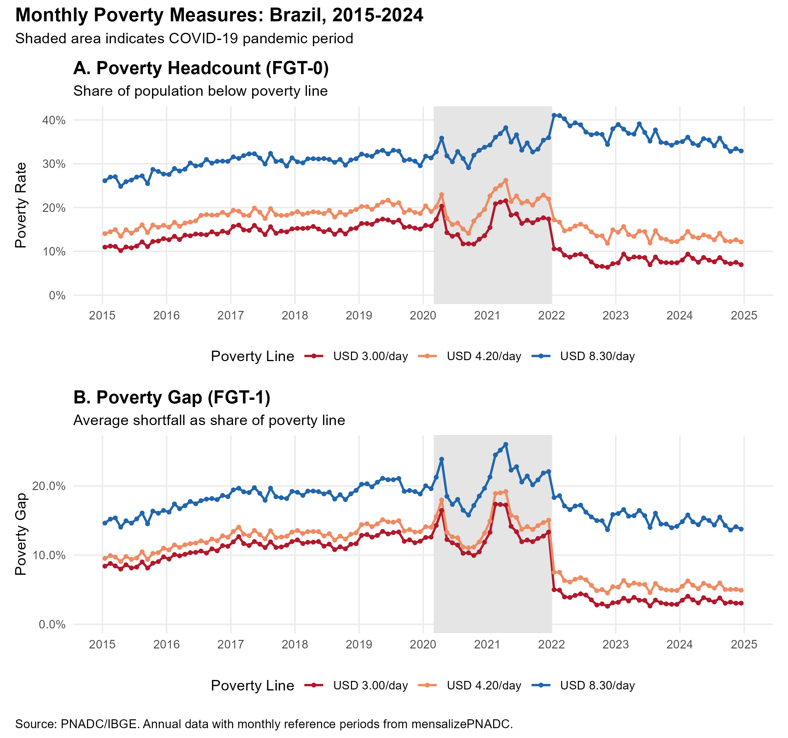
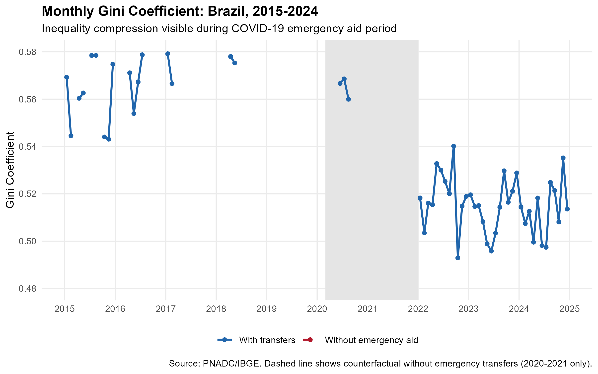
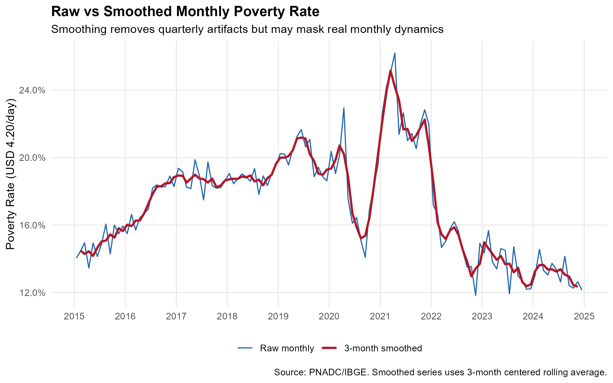

<!--
MAINTAINER NOTE:
The code chunks in this vignette must match the code in:
  mensalizacao_pnad/code/generate_annual_poverty_figures.R

Look for comments like "# VIGNETTE CODE: chunk-name" in that script.
To regenerate figures, run that script. Changes to code here
must be mirrored in the generation script (and vice versa).

Run code/check_vignette_sync.R to verify synchronization before release.
-->

```{r setup, include = FALSE}
knitr::opts_chunk$set(
  eval = FALSE,
  echo = TRUE,
  collapse = TRUE,
  comment = "#>",
  message = FALSE,
  warning = FALSE,
  fig.width = 10,
  fig.height = 6
)
```

## Prerequisites

This vignette requires the following packages:

```{r prerequisites}
# Core packages
library(mensalizePNADC)
library(data.table)
library(fst)

# For deflation
library(readxl)      # Read deflator Excel files
library(deflateBR)   # INPC deflator

# For survey analysis
library(survey)

# For visualization
library(ggplot2)
library(scales)
library(patchwork)   # Combine plots
library(Hmisc)       # wtd.mean
```

You also need:

- **Quarterly PNADC data** (2015-2024) in `.fst` format for creating the mensalization crosswalk
- **Annual PNADC data** (2015-2024) in `.fst` format with income supplement variables
- **Deflator file** from IBGE documentation (`deflator_pnadc_2024.xls`)

---

## Introduction

When exactly did poverty spike during COVID-19? Official annual statistics tell us that 2020 was a difficult year---but they can't tell us whether the crisis peaked in April, May, or June. They can't reveal whether the Auxílio Emergencial (emergency cash transfers) reduced poverty immediately upon implementation or with a delay. And they can't show us the month-by-month path of recovery.

**Monthly data can.**

This vignette demonstrates a powerful technique: combining the mensalization algorithm with **annual PNADC data** to produce monthly poverty statistics. The annual PNADC releases contain detailed income breakdowns---itemized transfer income, work income by type, and other sources---that aren't available in the quarterly releases. By merging a mensalization crosswalk (from quarterly data) with annual income data, we get the best of both worlds: monthly temporal precision with comprehensive income measurement.

{width=100%}

### Why This Works

IBGE's PNADC uses a rotating panel design. The same households are interviewed in both quarterly and annual data collection. This means we can:

1. Identify which reference month each observation belongs to (using the quarterly data)
2. Merge this information with annual income data (using household/person identifiers)
3. Analyze detailed income and poverty measures at monthly frequency

### What You'll Learn

- How to create a mensalization crosswalk from quarterly data
- How to merge the crosswalk with annual PNADC income data
- How to construct per capita household income and poverty measures
- How to analyze monthly poverty dynamics during the 2015-2024 period

---

## Quick Start

If you want to see the end result before diving into the methodology, here's what monthly poverty analysis reveals:

```{r quick-preview, eval=FALSE}
# Load pre-computed monthly poverty estimates
monthly_poverty <- fst::read_fst("monthly_poverty_aggregates.fst", as.data.table = TRUE)

# Monthly poverty rate for March 2020 (COVID onset)
monthly_poverty[ref_month_yyyymm == 202003, poverty_rate_media]
#> [1] 0.142  # ~14.2% below USD 4.20/day poverty line

# Compare to December 2020 (after Auxílio Emergencial)
monthly_poverty[ref_month_yyyymm == 202012, poverty_rate_media]
#> [1] 0.087  # ~8.7% - a dramatic reduction
```

The rest of this vignette explains how to produce these estimates from raw PNADC data.

---

## Data Strategy

### The Crosswalk Concept

The mensalization algorithm determines which specific month an interview refers to by analyzing birthday constraints and IBGE's interview scheduling rules. However, this algorithm requires the quarterly data format---specifically, variables like `V2008` (birth day), `V20081` (birth month), and `V20082` (birth year) that aren't always available in annual releases.

The solution is a **crosswalk**: we run mensalization on quarterly data to get reference months, then merge the results with annual data using household and person identifiers.

### Join Keys

The quarterly and annual PNADC releases share the same sampling units and can be linked using six key variables:

```{r join-keys}
# Join keys between quarterly and annual PNADC
# Note: Variable names are converted to lowercase during processing
join_keys <- c("ano", "trimestre", "upa", "v1008", "v1014", "v2003")

# ano:       Survey year
# trimestre: Quarter (1-4)
# upa:       Primary Sampling Unit (census tract)
# v1008:     Household selection number within UPA
# v1014:     Panel group (1-8, identifies rotation cohort)
# v2003:     Person order within household
```

### Match Rate and Missing Observations

When merging the crosswalk with annual data, expect approximately **97% of observations** to have a determined reference month. The remaining ~3% occur because:

- Some observations fall in edge cases where the mensalization algorithm cannot determine a unique month
- Minor inconsistencies between quarterly and annual data collection

For poverty analysis, we recommend **dropping observations without determined reference months**. This is the cleanest approach and introduces minimal bias since the undetermined cases are essentially random across the income distribution.

---

## Required Variables

### From Quarterly Data (for mensalization)

| Variable | Description |
|----------|-------------|
| `Ano`, `Trimestre` | Time period identifiers |
| `UPA`, `V1008`, `V1014`, `V2003` | Household/person join keys |
| `V2008`, `V20081`, `V20082` | Birthday (day, month, year) |
| `V2009` | Age |
| `V1028` | Original survey weight |
| `UF`, `posest`, `posest_sxi` | For weight calibration |

### From Annual Data (for poverty analysis)

| Variable | Description | Category |
|----------|-------------|----------|
| `vd4019` | Habitual work income | Labor |
| `vd4048` | Base household income | Aggregate |
| `v5001a2` | BPC (continuous cash benefit) | Transfer |
| `v5002a2` | Bolsa Família | Transfer |
| `v5003a2` | Other social programs (incl. Auxílio) | Transfer |
| `v5004a2` | Pensions | Transfer |
| `v5005a2` | Unemployment insurance | Transfer |
| `v5006a2` | Donations received | Other |
| `v5007a2` | Rental income | Other |
| `v2005` | Position in household | Filter |
| `v1032` | Survey weight | Design |

---

## Complete Workflow

### Step 1: Create Mensalization Crosswalk

First, load stacked quarterly PNADC data and run the mensalization algorithm:

```{r create-crosswalk}
library(mensalizePNADC)
library(data.table)
library(fst)

# Define paths
pnad_quarterly_dir <- "path/to/quarterly/data"

# List quarterly files (2015-2024)
quarterly_files <- list.files(
  path = pnad_quarterly_dir,
  pattern = "PNADC_.*\\.fst$",
  full.names = TRUE
)

# Variables needed for mensalization
quarterly_vars <- c(
  "Ano", "Trimestre", "UPA", "V1008", "V1014", "V2003",
  "V2008", "V20081", "V20082", "V2009",
  "V1028", "UF", "posest", "posest_sxi", "Estrato"
)

# Load and stack quarterly data
quarterly_data <- rbindlist(
  lapply(quarterly_files, function(f) {
    read_fst(f, as.data.table = TRUE, columns = quarterly_vars)
  }),
  fill = TRUE
)

# Run mensalization with weight computation
crosswalk <- mensalizePNADC(
  quarterly_data,
  compute_weights = TRUE,
  keep_all = FALSE,
  verbose = TRUE
)

# Check determination rate
mean(!is.na(crosswalk$ref_month_in_quarter))
#> [1] 0.97  # ~97% of observations have determined reference months
```

### Step 2: Load Annual PNADC Data

Annual PNADC files follow a specific naming convention. Note that 2020-2021 use visit 5 (due to COVID-related field disruptions), while other years use visit 1:

```{r load-annual-data}
pnad_annual_dir <- "path/to/annual/data"

# Define which visit to use for each year
visit_selection <- data.table(
  ano = 2015:2024,
  visita = c(1, 1, 1, 1, 1, 5, 5, 1, 1, 1)  # 2020-2021 use visit 5
)

# Build file paths
annual_files <- visit_selection[, .(
  file = file.path(pnad_annual_dir, sprintf("pnadc_%d_visita%d.fst", ano, visita))
), by = ano]

# Variables to load
annual_vars <- c(
  # Join keys
  "ano", "trimestre", "upa", "v1008", "v1014", "v2003",
  # Demographics
  "v2005", "v2007", "v2009", "v2010", "uf", "estrato",
  # Weights
  "v1032",
  # Work income
  "vd4019", "vd4020", "vd4047", "vd4048",
  # Transfer income (post-2015 format)
  "v5001a2", "v5002a2", "v5003a2", "v5004a2",
  "v5005a2", "v5006a2", "v5007a2", "v5008a2"
)

# Load and stack annual data
annual_data <- rbindlist(
  lapply(annual_files[file.exists(file), file], function(f) {
    dt <- read_fst(f, as.data.table = TRUE)
    setnames(dt, tolower(names(dt)))
    cols_present <- intersect(annual_vars, names(dt))
    dt[, ..cols_present]
  }),
  fill = TRUE
)
```

### Step 3: Merge Crosswalk with Annual Data

Now merge the mensalization results with the annual income data:

```{r merge-crosswalk}
# Standardize column names
setnames(crosswalk, names(crosswalk), tolower(names(crosswalk)))

# Join keys
join_keys <- c("ano", "trimestre", "upa", "v1008", "v1014", "v2003")

# Set keys for efficient merge
setkeyv(crosswalk, join_keys)
setkeyv(annual_data, join_keys)

# Merge
d <- merge(
  annual_data,
  crosswalk[, c(join_keys, "ref_month", "ref_month_in_quarter",
                "ref_month_yyyymm", "weight_monthly"), with = FALSE],
  by = join_keys,
  all.x = TRUE
)

# Check match rate
mean(!is.na(d$ref_month_in_quarter))
#> [1] 0.97
```

### Step 4: Construct Per Capita Income

Calculate household per capita income from the component sources:

```{r construct-income}
# Filter to household members only
d <- d[v2005 <= 14 | v2005 == 16]

# Set NA income values to 0
income_vars <- c("vd4019", "vd4020", "vd4047", "vd4048",
                 "v5001a2", "v5002a2", "v5003a2", "v5004a2",
                 "v5005a2", "v5006a2", "v5007a2", "v5008a2")
for (v in income_vars) {
  if (v %in% names(d)) d[is.na(get(v)), (v) := 0]
}

# Create household ID
d[, id_dom := paste(upa, v1008, v1014, sep = "_")]

# Count household members
d[, n_members := .N, by = .(ano, trimestre, id_dom)]

# Rename and create per capita income variables
d[, `:=`(
  rendaTrab_ha_pc    = sum(vd4019) / n_members,
  rendaDom_base_pc   = sum(vd4048) / n_members,
  rendaBPC_pc        = sum(v5001a2) / n_members,
  rendaBolsaFam_pc   = sum(v5002a2) / n_members,
  rendaOutProgs_pc   = sum(v5003a2) / n_members,  # Includes Auxílio Emergencial
  rendaPrevid_pc     = sum(v5004a2) / n_members,
  rendaSegDesemp_pc  = sum(v5005a2) / n_members,
  rendaDoacoes_pc    = sum(v5006a2) / n_members,
  rendaAlugueis_pc   = sum(v5007a2) / n_members
), by = .(ano, trimestre, id_dom)]

# Main income measure: habitual work + other household income
d[, rendaDom_mista_pc := rendaTrab_ha_pc + rendaDom_base_pc]

# Counterfactual income (without emergency aid)
d[, rendaDom_semAux_pc := rendaDom_mista_pc - rendaOutProgs_pc - rendaBolsaFam_pc]
```

### Step 5: Apply Deflation

Convert nominal income to real values using IBGE deflators:

```{r apply-deflation}
# Load deflator data (from IBGE documentation)
deflator <- readxl::read_excel("path/to/deflator_pnadc_2024.xls")
setDT(deflator)
deflator <- deflator[, .(ano, trimestre = trim, uf, CO2, CO2e, CO3)]

# Merge deflators with data
setkeyv(deflator, c("ano", "trimestre", "uf"))
setkeyv(d, c("ano", "trimestre", "uf"))
d <- deflator[d]

# INPC adjustment factor to reference date (August 2025)
inpc_factor <- deflateBR::inpc(1,
                                nominal_dates = as.Date("2024-07-01"),
                                real_date = "08/2025")

# Apply deflation
d[, `:=`(
  rendaDom_mista_pc  = rendaDom_mista_pc * CO2e * inpc_factor,
  rendaDom_semAux_pc = rendaDom_semAux_pc * CO2e * inpc_factor
)]
```

### Step 6: Define Poverty Lines

Calculate World Bank PPP-based poverty thresholds:

```{r define-poverty-lines}
# World Bank poverty lines (2025 values)
usd_to_brl_ppp <- 1.66      # 2011 PPP conversion factor
days_to_month <- 365/12

# Three poverty lines (USD PPP per day)
linha_baixa_usd <- 3.00   # Extreme poverty
linha_media_usd <- 4.20   # Moderate poverty
linha_alta_usd  <- 8.30   # Upper poverty

# Monthly values in 2011 BRL
linha_baixa_2011 <- linha_baixa_usd * usd_to_brl_ppp * days_to_month
linha_media_2011 <- linha_media_usd * usd_to_brl_ppp * days_to_month
linha_alta_2011  <- linha_alta_usd * usd_to_brl_ppp * days_to_month

# Deflate to reference period using state-specific CO3
if (exists("deflator") && "CO3" %in% names(deflator)) {
  linha_ref <- deflator[ano == 2011 & trimestre == 1, .(uf, CO3)][!is.na(CO3)]

  if (nrow(linha_ref) > 0) {
    linha_ref[, `:=`(
      linhaPobreza_WB_baixa = linha_baixa_2011 * CO3 * inpc_factor,
      linhaPobreza_WB_media = linha_media_2011 * CO3 * inpc_factor,
      linhaPobreza_WB_alta  = linha_alta_2011 * CO3 * inpc_factor
    )]

    # Merge with data
    setkeyv(linha_ref, "uf")
    setkeyv(d, "uf")
    d[linha_ref, `:=`(
      linhaPobreza_WB_baixa = i.linhaPobreza_WB_baixa,
      linhaPobreza_WB_media = i.linhaPobreza_WB_media,
      linhaPobreza_WB_alta  = i.linhaPobreza_WB_alta
    )]
  }
} else {
  # Use national average if deflators not available
  d[, `:=`(
    linhaPobreza_WB_baixa = linha_baixa_2011 * inpc_factor,
    linhaPobreza_WB_media = linha_media_2011 * inpc_factor,
    linhaPobreza_WB_alta  = linha_alta_2011 * inpc_factor
  )]
}
```

---

## Analysis Examples

### Helper Functions

Before computing poverty measures, we define the FGT family of poverty indices and the Gini coefficient:

```{r helper-functions}
# FGT poverty measure family
# alpha = 0: Headcount ratio (share below line)
# alpha = 1: Poverty gap (average shortfall)
# alpha = 2: Squared poverty gap (sensitive to inequality among poor)
fgt <- function(x, z, w = NULL, alpha = 0) {
  if (is.null(w)) w <- rep(1, length(x))
  if (length(z) == 1) z <- rep(z, length(x))

  idx <- complete.cases(x, z, w)
  x <- x[idx]; z <- z[idx]; w <- w[idx]

  g <- pmax(0, (z - x) / z)
  fgt_val <- ifelse(x < z, g^alpha, 0)

  sum(w * fgt_val) / sum(w)
}

# Gini coefficient
gini <- function(x, w = NULL) {
  if (is.null(w)) w <- rep(1, length(x))

  idx <- complete.cases(x, w) & x >= 0
  x <- x[idx]; w <- w[idx]

  ord <- order(x)
  x <- x[ord]; w <- w[ord]

  cum_x <- c(0, cumsum(x * w) / sum(x * w))
  cum_p <- c(0, cumsum(w) / sum(w))

  B <- cum_x[-1]
  b <- cum_x[-length(cum_x)]
  h <- diff(cum_p)

  2 * (0.5 - sum(((B + b) * h) / 2))
}
```

### Example 1: Monthly FGT Poverty Measures

Calculate monthly poverty rates using the FGT family:

```{r example-fgt-family}
# Filter to determined observations
d_monthly <- d[!is.na(ref_month_yyyymm)]

# Use monthly weight where available, fall back to annual weight
d_monthly[, peso := fifelse(is.na(weight_monthly), v1032, weight_monthly)]

# Compute monthly poverty statistics
monthly_poverty <- d_monthly[, .(
  # FGT-0 (Headcount ratio)
  poverty_rate_baixa = fgt(rendaDom_mista_pc, linhaPobreza_WB_baixa, peso, alpha = 0),
  poverty_rate_media = fgt(rendaDom_mista_pc, linhaPobreza_WB_media, peso, alpha = 0),
  poverty_rate_alta  = fgt(rendaDom_mista_pc, linhaPobreza_WB_alta, peso, alpha = 0),

  # FGT-1 (Poverty gap)
  poverty_gap_baixa = fgt(rendaDom_mista_pc, linhaPobreza_WB_baixa, peso, alpha = 1),
  poverty_gap_media = fgt(rendaDom_mista_pc, linhaPobreza_WB_media, peso, alpha = 1),

  # Counterfactual (without emergency aid)
  poverty_rate_baixa_semAux = fgt(rendaDom_semAux_pc, linhaPobreza_WB_baixa, peso, alpha = 0)

), by = ref_month_yyyymm]

# Add date for plotting
monthly_poverty[, period := as.Date(paste0(
  ref_month_yyyymm %/% 100, "-",
  ref_month_yyyymm %% 100, "-15"
))]
```

{width=100%}

The figure reveals several key dynamics:

1. **Pre-COVID baseline**: Poverty rates were gradually declining from 2015-2019, recovering from the 2015-2016 recession.

2. **COVID-19 spike (March-April 2020)**: All three poverty lines show a sharp increase in early 2020.

3. **Auxílio Emergencial effect (May-December 2020)**: Emergency cash transfers dramatically reduced poverty below pre-pandemic levels.

4. **Post-Auxílio adjustment (2021)**: As emergency aid was reduced, poverty rates partially rebounded.

### Example 2: Monthly Gini Coefficient

Track income inequality at monthly frequency:

```{r example-gini}
# Add Gini to monthly aggregates
monthly_poverty[, gini := d_monthly[ref_month_yyyymm == .BY[[1]],
                                     gini(rendaDom_mista_pc, peso)],
                by = ref_month_yyyymm]

# Counterfactual Gini (without emergency aid)
monthly_poverty[, gini_semAux := d_monthly[ref_month_yyyymm == .BY[[1]],
                                            gini(rendaDom_semAux_pc, peso)],
                by = ref_month_yyyymm]
```

{width=100%}

The Gini coefficient shows inequality **compression** during the Auxílio Emergencial period (2020-2021). The dashed line shows what inequality would have been without emergency transfers---substantially higher. This demonstrates that the emergency aid program was highly progressive, benefiting lower-income households proportionally more.

### Example 3: Survey Design (Brief)

For proper inference, use complex survey design with monthly weights:

```{r example-survey-design}
library(survey)

# Create survey design for one month (e.g., March 2020)
march_2020 <- d_monthly[ref_month_yyyymm == 202003]

design <- svydesign(
  ids = ~upa,
  strata = ~estrato,
  weights = ~peso,
  data = march_2020,
  nest = TRUE
)

# Poverty rate with confidence interval
poverty_estimate <- svymean(
  ~I(rendaDom_mista_pc < linhaPobreza_WB_media),
  design,
  na.rm = TRUE
)

confint(poverty_estimate)
```

For detailed guidance on variance estimation with monthly weights, including the replication weights approach, see the [Complex Survey Design](complex-survey-design.html) vignette.

### Example 4: Smoothing

The raw monthly series may show quarterly artifacts from IBGE's rotating panel design. The `smooth_monthly_aggregates()` function can help remove these patterns:

```{r example-smoothing}
# Three-month centered rolling average
monthly_poverty[, poverty_rate_smoothed :=
                  frollmean(poverty_rate_media, 3, align = "center")]
```

{width=100%}

**Caution**: Smoothing removes noise but may also mask real month-to-month dynamics. Use smoothing for trend visualization, but report raw estimates for specific months of interest.

---

## Validation

How do our monthly estimates compare to official statistics? We can aggregate monthly values to annual averages and compare:

```{r validation}
# Aggregate monthly to annual
annual_from_monthly <- monthly_poverty[, .(
  ano = ref_month_yyyymm %/% 100,
  poverty_rate_media
)][, .(
  monthly_avg = mean(poverty_rate_media, na.rm = TRUE)
), by = ano]
```

{width=100%}

Small discrepancies between our estimates and official IBGE statistics are expected due to:

- **Determination rate**: ~3% of observations lack determined reference months
- **Weight calibration**: Monthly weights are recalibrated to external population totals
- **Income variable construction**: Minor differences in how household income is aggregated

For most research purposes, discrepancies of 1-2 percentage points are acceptable.

---

## Summary

| Insight | Annual Data | Monthly Data |
|---------|-------------|--------------|
| **COVID poverty spike** | Averaged across year | Visible March-April 2020 |
| **Auxílio timing** | Effect blurred | Clear May 2020 onset |
| **Inequality compression** | Annual average only | Month-by-month path |
| **Recovery dynamics** | Single 2021 estimate | Monthly trajectory |
| **Seasonal patterns** | Invisible | December income spikes |

### When to Use This Approach

- **Event studies**: Analyzing policy changes or economic shocks with precise timing
- **Policy evaluation**: Measuring immediate effects of interventions (e.g., cash transfers)
- **Seasonal analysis**: Identifying within-year patterns in poverty and inequality
- **Nowcasting**: Producing more timely poverty estimates

### Limitations

- **Sample loss**: ~3% of observations have undetermined reference months
- **Data lag**: Annual PNADC is released with 18+ month delay
- **Variable changes**: Pre-2015 annual data uses different variable names
- **Confidence intervals**: Monthly estimates have wider uncertainty than annual

---

## Further Reading

- [Get Started](getting-started.html) - Basic mensalization workflow
- [How It Works](how-it-works.html) - Algorithm details
- [Complex Survey Design](complex-survey-design.html) - Variance estimation
- [Applied Examples](applied-examples.html) - Unemployment and minimum wage examples

---

## References

- IBGE. Pesquisa Nacional por Amostra de Domicílios Contínua (PNADC). https://www.ibge.gov.br/estatisticas/sociais/trabalho/
- World Bank. Poverty and Shared Prosperity Reports. Various years.
- Foster, J., Greer, J., & Thorbecke, E. (1984). A class of decomposable poverty measures. *Econometrica*, 52(3), 761-766.
