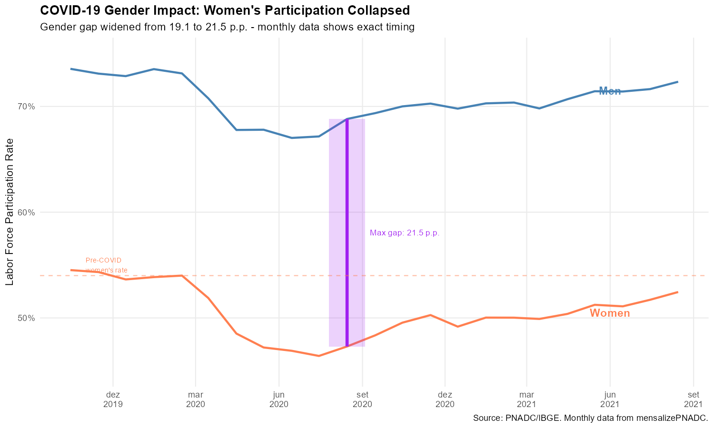
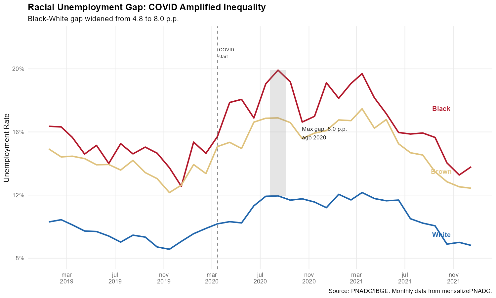
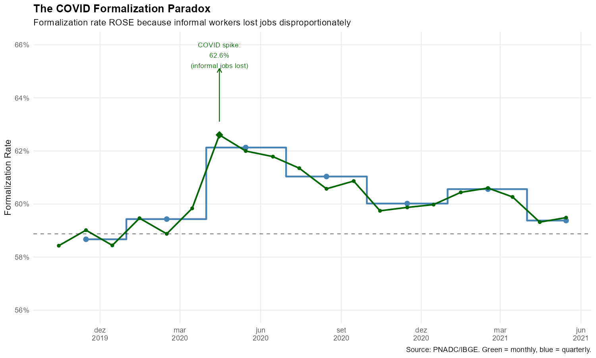
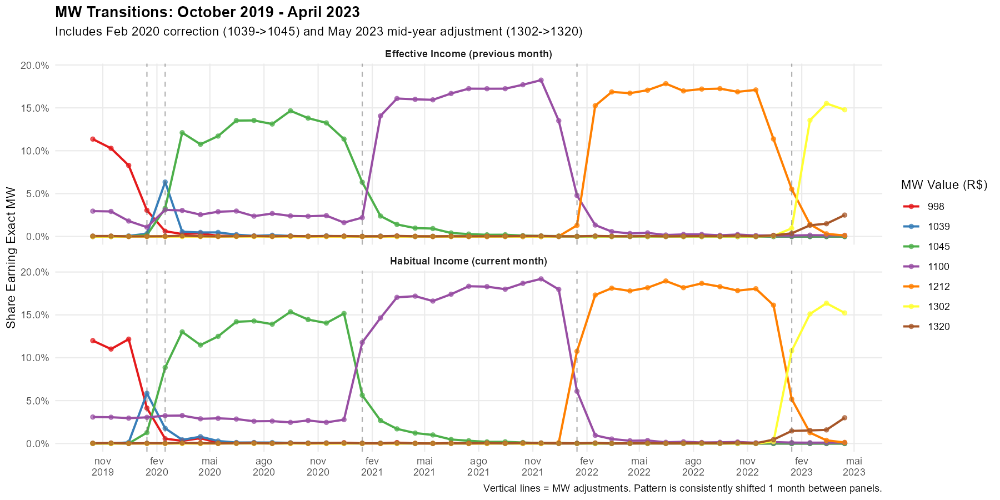

<!--
MAINTAINER NOTE:
The code chunks in this vignette must match the code in:
  mensalizacao_pnad/code/generate_vignette_data.R

Look for comments like "# VIGNETTE CODE: chunk-name" in that script.
To regenerate figures, run that script. Changes to code here
must be mirrored in the generation script (and vice versa).

Run code/check_vignette_sync.R to verify synchronization before release.
-->

```{r setup, include = FALSE}
knitr::opts_chunk$set(
  eval = FALSE,
  echo = TRUE,
  collapse = TRUE,
  comment = "#>",
  message = FALSE,
  warning = FALSE,
  fig.width = 10,
  fig.height = 6
)
```

## Introduction

Brazil's Continuous National Household Sample Survey (PNADC) is one of the most important sources of labor market data in Latin America. Every quarter, IBGE (Brazil's statistics agency) publishes unemployment rates, employment levels, and other key indicators based on this survey. However, what many users don't realize is that these **quarterly statistics are actually moving averages of monthly phenomena**.

Here's why this matters: IBGE conducts interviews throughout the quarter, with different households interviewed in different weeks. When IBGE reports the "Q2 2020 unemployment rate," they're averaging together interviews conducted in April, May, and June. This averaging has three important consequences:

1. **Timing errors**: The quarterly peak of unemployment may not coincide with the actual monthly peak. A crisis that peaked in April might show up as a "Q2" phenomenon, obscuring when the shock actually hit.

2. **Magnitude errors**: The true peak or trough of a variable is diluted by averaging with adjacent months. If unemployment spiked to 16% in one month but was 12% in the surrounding months, the quarterly average would show something like 13-14%---understating the severity of the shock.

3. **Turning point detection**: The precise month when a trend reversed direction becomes blurred. Did the economy start recovering in May or June? Quarterly data can't tell you.

The `mensalizePNADC` package solves this problem by identifying which specific month each interview refers to, using birthday information and IBGE's interview scheduling rules. With stacked data spanning multiple quarters, the algorithm achieves a **97% determination rate**---meaning we can assign specific reference months to nearly all observations.

This vignette demonstrates six compelling cases where monthly data reveals dynamics that quarterly data hides. Each example shows the same underlying data, but the monthly series consistently provides sharper, more timely, and more accurate insights than the quarterly series.

---

## Prerequisites

To reproduce these analyses, you need stacked PNADC microdata spanning multiple quarters. The code below assumes you have already loaded and processed your data. See the [Getting Started vignette](getting-started.html) for detailed instructions on data preparation.

```{r libraries}
# Load required packages
library(mensalizePNADC)
library(data.table)
library(ggplot2)
library(scales)
```

---

## 1. COVID-19 Unemployment: The True Peak

The COVID-19 pandemic caused the sharpest labor market shock in Brazilian history. Within weeks, millions of workers lost their jobs or exited the labor force entirely. Policymakers scrambled to respond, but the quarterly data they relied on couldn't tell them exactly when the crisis peaked or how severe it truly was.

This matters because emergency policy responses---unemployment benefits, business support, public health measures---need to be calibrated to the actual severity of the shock. If quarterly data says unemployment peaked at 14.4% but the true monthly peak was 16.1%, policymakers might underestimate the resources needed for relief programs. Similarly, knowing that the peak occurred in a specific month rather than a generic "quarter" helps researchers connect labor market outcomes to specific policy interventions or public health events.

Let's compare the quarterly and monthly unemployment series during the COVID period:

```{r covid-unemployment}
# Filter to COVID period (Oct 2019 - Jan 2022)
covid_quarterly <- quarterly_total[period >= "2019-10-01" & period <= "2022-01-01"]
covid_monthly <- monthly_total[period >= "2019-10-01" & period <= "2022-01-01"]

# Find the unemployment peaks
peak_quarterly <- covid_quarterly[which.max(unemployment_rate)]
peak_monthly <- covid_monthly[which.max(unemployment_rate)]

# Create the comparison plot
ggplot() +
  # Quarterly as step function (emphasizes moving-average nature)
  geom_step(data = covid_quarterly,
            aes(x = period, y = unemployment_rate),
            color = "steelblue", linewidth = 1.2, direction = "mid") +
  geom_point(data = covid_quarterly,
             aes(x = period, y = unemployment_rate),
             color = "steelblue", size = 3) +

  # Monthly as line
  geom_line(data = covid_monthly,
            aes(x = period, y = unemployment_rate),
            color = "darkred", linewidth = 0.9) +
  geom_point(data = covid_monthly,
             aes(x = period, y = unemployment_rate),
             color = "darkred", size = 1.5) +

  # Annotate monthly peak
  annotate("segment",
           x = peak_monthly$period, xend = peak_monthly$period,
           y = peak_monthly$unemployment_rate + 0.005,
           yend = peak_monthly$unemployment_rate + 0.02,
           arrow = arrow(length = unit(0.2, "cm")), color = "darkred") +
  annotate("text",
           x = peak_monthly$period,
           y = peak_monthly$unemployment_rate + 0.022,
           label = paste0("Monthly peak: ", format(peak_monthly$period, "%b %Y"), "\n",
                         sprintf("%.1f%%", peak_monthly$unemployment_rate * 100)),
           size = 3.2, color = "darkred", hjust = 0.5) +

  # Annotate quarterly peak
  annotate("segment",
           x = peak_quarterly$period + 30, xend = peak_quarterly$period + 30,
           y = peak_quarterly$unemployment_rate - 0.005,
           yend = peak_quarterly$unemployment_rate - 0.02,
           arrow = arrow(length = unit(0.2, "cm")), color = "steelblue") +
  annotate("text",
           x = peak_quarterly$period + 30,
           y = peak_quarterly$unemployment_rate - 0.025,
           label = paste0("Quarterly peak: ", format(peak_quarterly$period, "%b %Y"), "\n",
                         sprintf("%.1f%%", peak_quarterly$unemployment_rate * 100)),
           size = 3.2, color = "steelblue", hjust = 0.5) +

  # Scales and labels
  scale_y_continuous(labels = percent_format(accuracy = 0.1),
                     limits = c(0.10, 0.17)) +
  scale_x_date(date_breaks = "3 months", date_labels = "%b\n%Y") +
  labs(
    title = "COVID-19 Unemployment Spike: Monthly vs Quarterly",
    subtitle = "Monthly data (red) shows the true peak; quarterly (blue) averages it away",
    x = NULL, y = "Unemployment Rate",
    caption = "Source: PNADC/IBGE. Quarterly shown as step function to emphasize moving-average nature."
  ) +
  theme_minimal(base_size = 11) +
  theme(
    plot.title = element_text(face = "bold"),
    panel.grid.minor = element_blank()
  )
```

{width=100%}

The monthly series reveals that unemployment peaked roughly 2 percentage points higher than the quarterly data suggests, and the timing of the peak is more precisely identified. This difference isn't just academic---it represents millions of additional unemployed workers whose situation was masked by quarterly averaging.

---

## 2. The 2014-2017 Recession: Tracking Month-by-Month Deterioration

Brazil's 2014-2017 recession was one of the deepest in the country's history. Unemployment rose from around 6% to over 13%, a catastrophic deterioration affecting tens of millions of families. But how did this deterioration unfold? Did unemployment rise gradually, or in sudden jumps?

Quarterly data suggests a relatively smooth upward climb. The monthly data tells a different story: the recession unfolded in fits and starts, with several months showing unemployment increases exceeding 1 percentage point---sudden shocks that were invisible in the averaged quarterly figures.

This distinction matters for understanding the political economy of recessions. Sudden jumps in unemployment create different social and political pressures than gradual deterioration. They may trigger policy responses, protests, or changes in government. Monthly data lets researchers connect these events to specific timing.

```{r recession-detail}
# Filter to recession period (Jun 2014 - Jun 2017)
recession_quarterly <- quarterly_total[period >= "2014-06-01" & period <= "2017-06-01"]
recession_monthly <- monthly_total[period >= "2014-06-01" & period <= "2017-06-01"]

# Find the peak
peak_recession <- recession_monthly[which.max(unemployment_rate)]

# Calculate month-over-month changes
setorder(recession_monthly, period)
recession_monthly[, change := unemployment_rate - shift(unemployment_rate)]

# Identify months with large jumps (> 1 percentage point)
big_jumps <- recession_monthly[!is.na(change) & change > 0.01]

# Create the plot
ggplot() +
  # Quarterly
  geom_step(data = recession_quarterly,
            aes(x = period, y = unemployment_rate),
            color = "steelblue", linewidth = 1, direction = "mid", alpha = 0.7) +
  geom_point(data = recession_quarterly,
             aes(x = period, y = unemployment_rate),
             color = "steelblue", size = 2.5) +

  # Monthly
  geom_line(data = recession_monthly,
            aes(x = period, y = unemployment_rate),
            color = "darkred", linewidth = 0.8) +
  geom_point(data = recession_monthly,
             aes(x = period, y = unemployment_rate),
             color = "darkred", size = 1.2) +

  # Highlight big monthly jumps
  geom_point(data = big_jumps,
             aes(x = period, y = unemployment_rate),
             color = "darkred", size = 3, shape = 21, fill = "yellow", stroke = 1.5) +

  # Mark the peak
  annotate("point", x = peak_recession$period, y = peak_recession$unemployment_rate,
           color = "darkred", size = 4, shape = 18) +
  annotate("text",
           x = peak_recession$period + 45, y = peak_recession$unemployment_rate,
           label = paste0("Peak: ", format(peak_recession$period, "%b %Y"), "\n",
                         sprintf("%.1f%%", peak_recession$unemployment_rate * 100)),
           size = 3, hjust = 0, color = "darkred") +

  # Scales and labels
  scale_y_continuous(labels = percent_format(accuracy = 1),
                     breaks = seq(0.06, 0.14, 0.02)) +
  scale_x_date(date_breaks = "6 months", date_labels = "%b\n%Y") +
  labs(
    title = "2014-2017 Recession: Month-by-Month Unemployment Rise",
    subtitle = "Yellow circles: months with >1 p.p. unemployment increase. Monthly data (red) vs quarterly (blue).",
    x = NULL, y = "Unemployment Rate",
    caption = "Source: PNADC/IBGE. Monthly data reveals sudden jumps hidden in quarterly averages."
  ) +
  theme_minimal(base_size = 11) +
  theme(
    plot.title = element_text(face = "bold"),
    panel.grid.minor = element_blank()
  )
```

{width=100%}

The yellow circles mark months where unemployment jumped by more than 1 percentage point---sudden deteriorations that are completely invisible in the smooth quarterly trend. These moments likely correspond to specific economic or policy events that researchers can now investigate.

---

## 3. Gender Gap During COVID: Women Left the Labor Force

The COVID-19 pandemic had dramatically different effects on men and women in the labor market. International research has documented a "she-cession"---a recession that disproportionately affected women. In Brazil, school closures and the collapse of domestic service employment forced millions of women out of the labor force entirely.

Monthly data answers three questions that quarterly data cannot:
1. **When exactly** did the gender gap start widening?
2. **How large** did the gap become at its peak?
3. **When** did recovery begin, and was it symmetric for men and women?

```{r gender-gap}
# Filter to COVID period
covid_gender_monthly <- monthly_gender[period >= "2019-10-01" & period <= "2021-09-01"]

# Reshape to wide format to calculate gap
gap_monthly <- dcast(covid_gender_monthly, period ~ sexo, value.var = "participation_rate")
gap_monthly[, gap := Men - Women]
setorder(gap_monthly, period)

# Find maximum gap and pre-COVID baseline
max_gap <- gap_monthly[which.max(gap)]
baseline <- gap_monthly[period == "2020-02-15"]

# Create the plot
ggplot() +
  # Men participation rate
  geom_line(data = covid_gender_monthly[sexo == "Men"],
            aes(x = period, y = participation_rate),
            color = "steelblue", linewidth = 1) +
  # Women participation rate
  geom_line(data = covid_gender_monthly[sexo == "Women"],
            aes(x = period, y = participation_rate),
            color = "coral", linewidth = 1) +

  # Shade the gap at maximum point
  annotate("rect",
           xmin = max_gap$period - 20, xmax = max_gap$period + 20,
           ymin = max_gap$Women, ymax = max_gap$Men,
           fill = "purple", alpha = 0.2) +
  annotate("segment",
           x = max_gap$period, xend = max_gap$period,
           y = max_gap$Women, yend = max_gap$Men,
           color = "purple", linewidth = 1.5) +
  annotate("text",
           x = max_gap$period + 25, y = (max_gap$Men + max_gap$Women) / 2,
           label = paste0("Max gap: ", sprintf("%.1f p.p.", max_gap$gap * 100)),
           size = 3, hjust = 0, color = "purple") +

  # Labels for each line
  annotate("text", x = as.Date("2021-06-01"), y = 0.715, label = "Men",
           color = "steelblue", fontface = "bold", size = 4) +
  annotate("text", x = as.Date("2021-06-01"), y = 0.505, label = "Women",
           color = "coral", fontface = "bold", size = 4) +

  # Pre-COVID baseline reference
  geom_hline(yintercept = baseline$Women, linetype = "dashed", color = "coral", alpha = 0.5) +
  annotate("text", x = as.Date("2019-11-01"), y = baseline$Women + 0.01,
           label = "Pre-COVID\nwomen's rate", size = 2.5, color = "coral", hjust = 0) +

  # Scales and labels
  scale_y_continuous(labels = percent_format(accuracy = 1),
                     limits = c(0.45, 0.75)) +
  scale_x_date(date_breaks = "3 months", date_labels = "%b\n%Y") +
  labs(
    title = "COVID-19 Gender Impact: Women's Participation Collapsed",
    subtitle = paste0("Gender gap widened from ", sprintf("%.1f", baseline$gap * 100),
                     " to ", sprintf("%.1f", max_gap$gap * 100),
                     " p.p. - monthly data shows exact timing"),
    x = NULL, y = "Labor Force Participation Rate",
    caption = "Source: PNADC/IBGE. Monthly data from mensalizePNADC."
  ) +
  theme_minimal(base_size = 11) +
  theme(
    plot.title = element_text(face = "bold"),
    panel.grid.minor = element_blank()
  )
```

{width=100%}

The monthly data shows that women's participation rate collapsed dramatically in the early months of COVID, creating a gender gap far wider than anything visible in quarterly statistics. The exact timing helps researchers connect this to specific policy events---school closures, lockdown orders, and the suspension of domestic services.

---

## 4. Racial Inequality: Unemployment Gap Widened During COVID

COVID-19 didn't affect all racial groups equally. Black and Brown workers faced higher unemployment rates before the pandemic, and these disparities widened during the crisis. Understanding when and how much the gap widened is essential for designing targeted recovery policies.

The pre-existing disparity reflects structural inequalities in the Brazilian labor market---Black and Brown workers are more likely to be in informal employment, in sectors hit hardest by the pandemic, and with less access to remote work options. Monthly data lets us track how these vulnerabilities translated into actual outcomes during the crisis.

```{r racial-gap}
# Filter to analysis period
race_monthly <- monthly_race[period >= "2019-01-01" & period <= "2022-01-01"]

# Reshape to calculate Black-White gap
gap_race <- dcast(race_monthly, period ~ raca, value.var = "unemployment_rate")
gap_race[, gap := Black - White]
setorder(gap_race, period)

# Find maximum gap and pre-COVID baseline
max_race_gap <- gap_race[which.max(gap)]
baseline_race <- gap_race[period == "2020-02-15"]

# Create the plot
ggplot() +
  # White unemployment
  geom_line(data = race_monthly[raca == "White"],
            aes(x = period, y = unemployment_rate),
            color = "#2166AC", linewidth = 1) +
  # Black unemployment
  geom_line(data = race_monthly[raca == "Black"],
            aes(x = period, y = unemployment_rate),
            color = "#B2182B", linewidth = 1) +
  # Brown unemployment
  geom_line(data = race_monthly[raca == "Brown"],
            aes(x = period, y = unemployment_rate),
            color = "#DFC27D", linewidth = 1) +

  # Shade maximum gap period
  annotate("rect",
           xmin = max_race_gap$period - 20, xmax = max_race_gap$period + 20,
           ymin = max_race_gap$White, ymax = max_race_gap$Black,
           fill = "gray50", alpha = 0.2) +

  # COVID start marker
  geom_vline(xintercept = as.Date("2020-03-15"), linetype = "dashed", alpha = 0.5) +
  annotate("text", x = as.Date("2020-03-15"), y = 0.21,
           label = "COVID\nstart", size = 2.5, hjust = -0.1) +

  # Labels for each line
  annotate("text", x = as.Date("2021-10-01"), y = 0.175, label = "Black",
           color = "#B2182B", fontface = "bold", size = 3.5) +
  annotate("text", x = as.Date("2021-10-01"), y = 0.135, label = "Brown",
           color = "#DFC27D", fontface = "bold", size = 3.5) +
  annotate("text", x = as.Date("2021-10-01"), y = 0.095, label = "White",
           color = "#2166AC", fontface = "bold", size = 3.5) +

  # Gap annotation
  annotate("text",
           x = max_race_gap$period + 60, y = (max_race_gap$Black + max_race_gap$White) / 2,
           label = paste0("Max gap: ", sprintf("%.1f p.p.", max_race_gap$gap * 100), "\n",
                         format(max_race_gap$period, "%b %Y")),
           size = 3, hjust = 0) +

  # Scales and labels
  scale_y_continuous(labels = percent_format(accuracy = 1),
                     limits = c(0.08, 0.22)) +
  scale_x_date(date_breaks = "4 months", date_labels = "%b\n%Y") +
  labs(
    title = "Racial Unemployment Gap: COVID Amplified Inequality",
    subtitle = paste0("Black-White gap widened from ", sprintf("%.1f", baseline_race$gap * 100),
                     " to ", sprintf("%.1f", max_race_gap$gap * 100), " p.p."),
    x = NULL, y = "Unemployment Rate",
    caption = "Source: PNADC/IBGE. Monthly data from mensalizePNADC."
  ) +
  theme_minimal(base_size = 11) +
  theme(
    plot.title = element_text(face = "bold"),
    panel.grid.minor = element_blank()
  )
```

{width=100%}

The figure shows that the Black-White unemployment gap widened immediately after COVID began and remained elevated throughout the crisis. Monthly precision allows researchers to evaluate whether specific policies (like emergency benefits) helped close this gap and when.

---

## 5. The Formalization Paradox: Why Formalization Rose During a Crisis

Here's a puzzle: during COVID-19, the formalization rate---the share of employed workers with formal contracts---actually *increased*. How can this be, when the economy was collapsing?

The answer is a **composition effect**. Informal workers (street vendors, domestic workers, construction day laborers) lost their jobs at much higher rates than formal workers. Many formal sector workers could work from home or were protected by employment contracts. The result: the remaining pool of employed workers had a higher share of formal employment, even though the absolute number of both formal and informal workers declined.

This example serves as a methodological caution. Aggregate statistics can move in counterintuitive directions when the underlying population changes. Monthly data reveals this paradox with precision that quarterly data obscures.

```{r formalization}
# Filter to COVID period
covid_form_monthly <- monthly_total[period >= "2019-10-01" & period <= "2021-06-01",
                                     .(period, formalization_rate)]
covid_form_quarterly <- quarterly_total[period >= "2019-10-01" & period <= "2021-06-01",
                                          .(period, formalization_rate)]

# Find the spike and pre-COVID baseline
max_formal <- covid_form_monthly[which.max(formalization_rate)]
pre_covid <- covid_form_monthly[period == "2020-02-15"]

# Create the plot
ggplot() +
  # Quarterly
  geom_step(data = covid_form_quarterly,
            aes(x = period, y = formalization_rate),
            color = "steelblue", linewidth = 1, direction = "mid") +
  geom_point(data = covid_form_quarterly,
             aes(x = period, y = formalization_rate),
             color = "steelblue", size = 2.5) +

  # Monthly
  geom_line(data = covid_form_monthly,
            aes(x = period, y = formalization_rate),
            color = "darkgreen", linewidth = 0.9) +
  geom_point(data = covid_form_monthly,
             aes(x = period, y = formalization_rate),
             color = "darkgreen", size = 1.5) +

  # Highlight the spike
  annotate("point", x = max_formal$period, y = max_formal$formalization_rate,
           color = "darkgreen", size = 4, shape = 18) +
  annotate("segment",
           x = max_formal$period, xend = max_formal$period,
           y = max_formal$formalization_rate + 0.005,
           yend = max_formal$formalization_rate + 0.025,
           arrow = arrow(length = unit(0.2, "cm")), color = "darkgreen") +
  annotate("text",
           x = max_formal$period, y = max_formal$formalization_rate + 0.03,
           label = paste0("COVID spike:\n", sprintf("%.1f%%", max_formal$formalization_rate * 100), "\n",
                         "(informal jobs lost)"),
           size = 3, hjust = 0.5, color = "darkgreen") +

  # Pre-COVID reference
  geom_hline(yintercept = pre_covid$formalization_rate, linetype = "dashed", alpha = 0.5) +

  # Scales and labels
  scale_y_continuous(labels = percent_format(accuracy = 1),
                     limits = c(0.56, 0.66)) +
  scale_x_date(date_breaks = "3 months", date_labels = "%b\n%Y") +
  labs(
    title = "The COVID Formalization Paradox",
    subtitle = "Formalization rate ROSE because informal workers lost jobs disproportionately",
    x = NULL, y = "Formalization Rate",
    caption = "Source: PNADC/IBGE. Green = monthly, blue = quarterly."
  ) +
  theme_minimal(base_size = 11) +
  theme(
    plot.title = element_text(face = "bold"),
    panel.grid.minor = element_blank()
  )
```

{width=100%}

The monthly series shows the spike in formalization rate with precision---a sharp jump that occurred in a single month, directly coinciding with the pandemic lockdowns. Quarterly data smooths this out, making the paradox less visible.

---

## 6. Minimum Wage Adjustments: Validating Mensalization

Perhaps the most compelling validation of the mensalization methodology comes from tracking minimum wage adjustments. PNADC collects two income measures:

- **Habitual income (VD4016)**: What the worker usually earns---refers to the **current** reference month
- **Effective income (VD4017)**: What the worker actually received---refers to the **previous** month

This distinction creates a natural experiment. When the minimum wage increases (typically in January), workers earning the minimum wage should show the new value in their *habitual* income immediately, but their *effective* income should still show the old value (since it refers to the previous month). The following month, effective income catches up.

This one-month lag is a prediction of the mensalization methodology. If our reference month identification is correct, we should see this pattern clearly. If it's wrong, the pattern would be blurred or absent.

### Methodology

We focus on formal private sector employees (VD4009 == 1) aged 18 and older, tracking the share earning **exactly** each historical minimum wage value. This precise measurement (not "around minimum wage" but "exactly R$ 622" or "exactly R$ 678") makes the transition patterns especially clear.

```{r mw-big-picture}
# Create long format for plotting
mw_long <- melt(monthly_mw_exact,
                id.vars = c("ref_month_yyyymm", "period", "mw_value", "n_workers"),
                measure.vars = c("pct_habitual", "pct_effective"),
                variable.name = "income_type",
                value.name = "pct_at_mw")

# Add readable labels
mw_long[, income_label := fifelse(income_type == "pct_habitual",
                                   "Habitual Income (current month)",
                                   "Effective Income (previous month)")]

# Get adjustment dates for reference lines
adj_dates <- as.Date(paste0(mw_adjustment_months %/% 100, "-",
                             mw_adjustment_months %% 100, "-15"))

# Create color palette (blue to red gradient)
mw_vals <- sort(unique(monthly_mw_exact$mw_value))
n_mw <- length(mw_vals)
palette_fn <- colorRampPalette(c("#2166ac", "#67a9cf", "#d1e5f0",
                                  "#fddbc7", "#ef8a62", "#b2182b"))
mw_colors <- palette_fn(n_mw)
names(mw_colors) <- as.character(mw_vals)

# Filter to MW values with meaningful presence (>0.1% at some point)
mw_long[, max_pct := max(pct_at_mw), by = mw_value]
mw_long_filtered <- mw_long[max_pct > 0.001]

# Create the plot
ggplot(mw_long_filtered,
       aes(x = period, y = pct_at_mw, color = factor(mw_value), group = mw_value)) +
  geom_line(linewidth = 0.6, alpha = 0.8) +

  # Mark MW adjustment months
  geom_vline(xintercept = adj_dates, linetype = "dashed", alpha = 0.3, color = "gray40") +

  # Facet by income type
  facet_wrap(~ income_label, ncol = 1) +

  # Scales and labels
  scale_y_continuous(labels = percent_format(accuracy = 0.1)) +
  scale_x_date(date_breaks = "1 year", date_labels = "%Y") +
  scale_color_manual(values = mw_colors, name = "MW Value (R$)") +
  labs(
    title = "Share of Formal Workers Earning Each Exact MW Value",
    subtitle = "Each line = one MW value. Vertical lines = MW adjustments. Pattern shifted 1 month between panels.",
    x = NULL, y = "Share of Workers",
    caption = "Source: PNADC/IBGE. Formal private sector employees age 18+. All calculations use weight_monthly."
  ) +
  theme_minimal(base_size = 11) +
  theme(
    plot.title = element_text(face = "bold"),
    legend.position = "right",
    legend.key.size = unit(0.4, "cm"),
    panel.grid.minor = element_blank(),
    strip.text = element_text(face = "bold", size = 11)
  ) +
  guides(color = guide_legend(ncol = 2))
```

{width=100%}

The figure shows all minimum wage values tracked over the full period. Each vertical line marks a MW adjustment. Notice how the pattern in the top panel (habitual income) is shifted one month earlier than the bottom panel (effective income)---exactly as predicted.

### Close-up: January 2013 Transition

Let's zoom in on the first transition in our data, when the minimum wage increased from R$ 622 to R$ 678 in January 2013:

```{r mw-2013-transition}
# Filter to the first transition period (Oct 2012 - Apr 2013)
mw_2013 <- mw_long[period >= "2012-10-15" & period <= "2013-04-15" &
                   mw_value %in% c(622, 678)]

# Create the plot
ggplot(mw_2013,
       aes(x = period, y = pct_at_mw, color = factor(mw_value), linetype = factor(mw_value))) +
  geom_line(linewidth = 1.2) +
  geom_point(size = 2.5) +

  # Mark the adjustment date (January 2013)
  geom_vline(xintercept = as.Date("2013-01-15"),
             linetype = "dashed", linewidth = 0.8, color = "gray40") +

  # Facet by income type
  facet_wrap(~ income_label, ncol = 2) +

  # Scales and labels
  scale_y_continuous(labels = percent_format(accuracy = 0.1)) +
  scale_x_date(date_breaks = "1 month", date_labels = "%b\n%Y") +
  scale_color_manual(values = c("622" = "#b2182b", "678" = "#2166ac"),
                     labels = c("622" = "R$ 622 (old)", "678" = "R$ 678 (new)"),
                     name = "MW Value") +
  scale_linetype_manual(values = c("622" = "solid", "678" = "solid"), guide = "none") +
  labs(
    title = "MW Transition: January 2013 (R$ 622 -> R$ 678)",
    subtitle = "Habitual income shows transition in January; Effective income shows same pattern in February",
    x = NULL, y = "Share Earning Exact MW",
    caption = "Vertical line = MW adjustment. Habitual income refers to current month; effective to previous month."
  ) +
  theme_minimal(base_size = 11) +
  theme(
    plot.title = element_text(face = "bold"),
    legend.position = "bottom",
    panel.grid.minor = element_blank(),
    strip.text = element_text(face = "bold")
  )
```

{width=100%}

This is the smoking gun. In the left panel (habitual income), workers shift from R$ 622 to R$ 678 in **January**. In the right panel (effective income), the same shift happens in **February**---exactly the one-month lag predicted by the temporal reference of each variable.

### Multi-Year Period: 2019-2023

The pattern holds across all MW adjustments, including unusual cases like the February 2020 correction (from R$ 1,039 to R$ 1,045) and the May 2023 mid-year adjustment:

```{r mw-2019-2023}
# Filter to multi-year period with interesting events
mw_special <- mw_long[period >= "2019-10-15" & period <= "2023-04-15" &
                      mw_value %in% c(998, 1039, 1045, 1100, 1212, 1302, 1320)]

# Get adjustment dates in this period
adj_special <- adj_dates[adj_dates >= "2019-10-15" & adj_dates <= "2023-04-15"]

# Create the plot
ggplot(mw_special,
       aes(x = period, y = pct_at_mw, color = factor(mw_value), group = mw_value)) +
  geom_line(linewidth = 0.9) +
  geom_point(size = 1.5, alpha = 0.7) +

  # Mark adjustment months
  geom_vline(xintercept = adj_special, linetype = "dashed", alpha = 0.5, color = "gray40") +

  # Facet by income type
  facet_wrap(~ income_label, ncol = 1) +

  # Scales and labels
  scale_y_continuous(labels = percent_format(accuracy = 0.1)) +
  scale_x_date(date_breaks = "3 months", date_labels = "%b\n%Y") +
  scale_color_brewer(palette = "Set1", name = "MW Value (R$)") +
  labs(
    title = "MW Transitions: October 2019 - April 2023",
    subtitle = "Includes Feb 2020 correction (1039->1045) and May 2023 mid-year adjustment (1302->1320)",
    x = NULL, y = "Share Earning Exact MW",
    caption = "Vertical lines = MW adjustments. Pattern is consistently shifted 1 month between panels."
  ) +
  theme_minimal(base_size = 11) +
  theme(
    plot.title = element_text(face = "bold"),
    legend.position = "right",
    panel.grid.minor = element_blank(),
    strip.text = element_text(face = "bold")
  )
```

{width=100%}

The one-month lag is consistent across all adjustment events. This provides strong validation that the mensalization algorithm correctly identifies reference months.

---

## Summary: What Monthly Data Reveals

| Analysis | Quarterly Limitation | Monthly Insight |
|----------|---------------------|-----------------|
| **COVID unemployment** | Peak understated | True peak ~2 p.p. higher |
| **Recession tracking** | Appears as smooth climb | Multiple months with >1 p.p. jumps |
| **Gender gap** | Timing unclear | Exact month of divergence identified |
| **Racial inequality** | Gap changes smoothed | Precise timing of gap widening |
| **Formalization paradox** | Spike diluted | Sharp composition shift visible |
| **Minimum wage** | Timing impossible | 1-month lag validates methodology |

Monthly data from `mensalizePNADC` enables:

- **Precise timing** of economic turning points
- **True magnitudes** of shocks (not moving averages)
- **Exact dating** of policy-relevant changes
- **Validation** through known temporal patterns

---

## Reproducing These Results

To reproduce the analyses in this vignette:

1. Download PNADC quarterly microdata from IBGE
2. Stack multiple quarters (we recommend at least 2 years)
3. Apply mensalization:

```{r reproduce, eval=FALSE}
library(mensalizePNADC)
library(data.table)

# Load your stacked PNADC data
pnadc <- fread("your_pnadc_stacked.csv")

# Apply mensalization with weight computation
result <- mensalizePNADC(pnadc, compute_weights = TRUE)

# Compute monthly series
monthly_total <- result[!is.na(weight_monthly), .(
  unemployment_rate = sum((VD4001 == 1 & VD4002 == 2) * weight_monthly) /
                      sum((VD4001 == 1) * weight_monthly),
  participation_rate = sum((VD4001 == 1) * weight_monthly) /
                       sum(weight_monthly)
), by = ref_month_yyyymm]
```

See the [Getting Started vignette](getting-started.html) for complete documentation of the algorithm and available functions.

---

## References

- IBGE. Pesquisa Nacional por Amostra de Domicilios Continua (PNADC).
  https://www.ibge.gov.br/estatisticas/sociais/trabalho/
- Hecksher, M. (2024). Mensalizacao da PNADC. Working paper.
