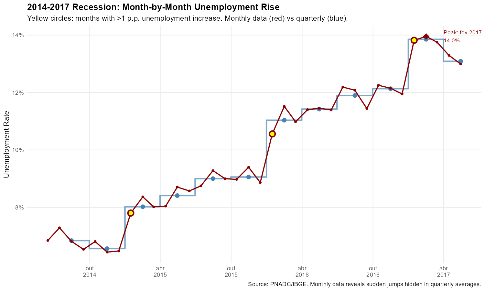
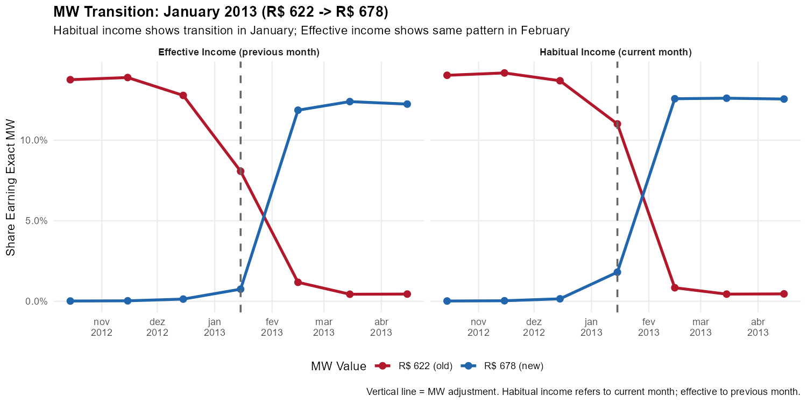

<!--
MAINTAINER NOTE:
The code chunks in this vignette must match the code in:
  mensalizacao_pnad/code/generate_vignette_data.R

Look for comments like "# VIGNETTE CODE: chunk-name" in that script.
To regenerate figures, run that script. Changes to code here
must be mirrored in the generation script (and vice versa).

Run code/check_vignette_sync.R to verify synchronization before release.
-->

```{r setup, include = FALSE}
knitr::opts_chunk$set(
  eval = FALSE,
  echo = TRUE,
  collapse = TRUE,
  comment = "#>",
  message = FALSE,
  warning = FALSE,
  fig.width = 10,
  fig.height = 6
)
```

## Introduction

Brazil's Continuous National Household Sample Survey (PNADC) is one of the most important sources of labor market data in Latin America. Regularly, IBGE (Brazil's statistics agency) publishes the quarterly and annual microdata used for the calculation of official labor market statistics: unemployment rates, employment levels, and other key indicators. However, what many users don't realize is that these **quarterly (or annual) statistics are actually an average of three-month phenomena**. In the official IBGE website for indicators extration (SIDRA) there is indeed monthly information. However, these monthly series are not a snapshot of a particular month, but instead a rolling average of all interviews conducted during three months.

This averaging has three important consequences:

1. **Timing errors**: The quarterly peak of unemployment may not coincide with the actual monthly peak. A crisis that peaked in April might show up as a "Q2" phenomenon, obscuring when the shock actually hit.

2. **Magnitude errors**: The true size of a peak or trough of a variable is diluted by averaging with adjacent months. If unemployment spiked to 16% in one month but was 12% in the surrounding months, the quarterly average would show something like 13-14%---understating the severity of the shock.

3. **Turning point detection**: The precise month when a trend reversed direction becomes blurred. Did the economy start recovering in May or June? Quarterly data can't tell you.

The `PNADCperiods` package solves this problem by identifying which specific month each interview refers to, using birthday information and IBGE's interview scheduling rules. With stacked data spanning multiple quarters, the algorithm achieves a **97% determination rate**---meaning we can assign specific reference months to nearly all observations.

This vignette demonstrates three compelling cases where monthly data reveals dynamics that quarterly data hides, culminating in a powerful validation using minimum wage transitions.

> **Working with poverty or income data?** This vignette focuses on **labor market** indicators using quarterly PNADC data. For poverty and income analysis using annual PNADC data (which includes comprehensive household income variables), see [Monthly Poverty Analysis with Annual PNADC Data](annual-poverty-analysis.html).

---

## Prerequisites

To reproduce these analyses, you need stacked PNADC microdata spanning multiple quarters. The code below assumes you have already loaded and processed your data. See [Download and Prepare Data](download-and-prepare.html) for data preparation, or [Get Started](getting-started.html) for basic usage.

```{r libraries}
# Load required packages
library(PNADCperiods)
library(data.table)
library(ggplot2)
library(scales)
```

---

## Preparing the Data

This section shows how to create the aggregate time series used in the examples below. 

### Step 1: Load and Mensalize Your Data

```{r load-data}
# Load your stacked PNADC data (see download-and-prepare vignette)
library(fst)
pnadc <- read_fst("path/to/your/pnadc_stacked.fst", as.data.table = TRUE)

# Build crosswalk (identify reference periods)
crosswalk <- pnadc_identify_periods(pnadc, verbose = TRUE)

# Apply crosswalk with weight calibration
pnadc <- pnadc_apply_periods(
  pnadc,
  crosswalk,
  weight_var = "V1028",
  anchor = "quarter",
  calibrate = TRUE
)
```

### Step 2: Create Labor Market Variables

```{r create-variables}
# Filter to working-age population (14+)
pnadc <- pnadc[V2009 >= 14]

# Create labor market indicators
pnadc[, `:=`(
  # PEA: Economically Active Population (VD4001 == 1)
  pea = fifelse(VD4001 == 1, 1L, 0L),

  # Employed (VD4002 == 1)
  employed = fifelse(VD4002 == 1, 1L, 0L),

  # Unemployed (in labor force but not employed)
  unemployed = fifelse(VD4002 == 2, 1L, 0L)
)]

# Formality indicator (among employed)
# Formal: positions 1,3,5,7 OR positions 8,9 with social security contribution
pnadc[, formal := fifelse(
  VD4009 %in% c(1L, 3L, 5L, 7L), 1L,
  fifelse(VD4009 %in% c(8L, 9L) & VD4012 == 1L, 1L, 0L)
)]
pnadc[VD4002 != 1, formal := NA_integer_]
```

### Step 3: Create Quarterly Series

Quarterly aggregates use the original IBGE weight (`V1028`):

```{r create-quarterly}
quarterly_total <- pnadc[, .(
  unemployment_rate = sum(unemployed * V1028, na.rm = TRUE) /
                      sum(pea * V1028, na.rm = TRUE),
  participation_rate = sum(pea * V1028, na.rm = TRUE) /
                       sum(V1028, na.rm = TRUE),
  formalization_rate = sum(formal * V1028, na.rm = TRUE) /
                       sum(employed * V1028, na.rm = TRUE)
), by = .(Ano, Trimestre)]

# Add period column for plotting (mid-quarter date)
quarterly_total[, period := as.Date(paste0(Ano, "-", (Trimestre - 1) * 3 + 2, "-15"))]
```

### Step 4: Create Monthly Series

Monthly aggregates use `weight_monthly` from PNADCperiods:

```{r create-monthly}
# Filter to observations with determined reference month
pnadc_monthly <- pnadc[!is.na(weight_monthly)]

monthly_total <- pnadc_monthly[, .(
  unemployment_rate = sum(unemployed * weight_monthly, na.rm = TRUE) /
                      sum(pea * weight_monthly, na.rm = TRUE),
  participation_rate = sum(pea * weight_monthly, na.rm = TRUE) /
                       sum(weight_monthly, na.rm = TRUE),
  formalization_rate = sum(formal * weight_monthly, na.rm = TRUE) /
                       sum(employed * weight_monthly, na.rm = TRUE)
), by = ref_month_yyyymm]

# Add period column for plotting (mid-month date)
monthly_total[, period := as.Date(paste0(
  ref_month_yyyymm %/% 100, "-",
  ref_month_yyyymm %% 100, "-15"
))]
```

With these objects created, you can now run all the examples below.

---

## 1. COVID-19 Unemployment: The True Peak

The COVID-19 pandemic caused the sharpest labor market shock in Brazilian history. Within weeks, millions of workers lost their jobs or exited the labor force entirely. Policymakers scrambled to respond, but the quarterly data they relied on couldn't tell them exactly when the crisis peaked or how severe it truly was.

This matters because emergency policy responses---unemployment benefits, business support, public health measures---need to be calibrated to the actual severity of the shock. If quarterly data says unemployment peaked at 14.4% but the true monthly peak was 16.1%, policymakers might underestimate the resources needed for relief programs. Similarly, knowing that the peak occurred in a specific month rather than a generic "quarter" helps researchers connect labor market outcomes to specific policy interventions or public health events.

Let's compare the quarterly and monthly unemployment series during the COVID period:

```{r covid-unemployment}
# Filter to COVID period (Oct 2019 - Jan 2022)
covid_quarterly <- quarterly_total[period >= "2019-10-01" & period <= "2022-01-01"]
covid_monthly <- monthly_total[period >= "2019-10-01" & period <= "2022-01-01"]

# Find the unemployment peaks
peak_quarterly <- covid_quarterly[which.max(unemployment_rate)]
peak_monthly <- covid_monthly[which.max(unemployment_rate)]

# Create the comparison plot
ggplot() +
  # Quarterly as step function (emphasizes moving-average nature)
  geom_step(data = covid_quarterly,
            aes(x = period, y = unemployment_rate),
            color = "steelblue", linewidth = 1.2, direction = "mid") +
  geom_point(data = covid_quarterly,
             aes(x = period, y = unemployment_rate),
             color = "steelblue", size = 3) +

  # Monthly as line
  geom_line(data = covid_monthly,
            aes(x = period, y = unemployment_rate),
            color = "darkred", linewidth = 0.9) +
  geom_point(data = covid_monthly,
             aes(x = period, y = unemployment_rate),
             color = "darkred", size = 1.5) +

  # Annotate monthly peak
  annotate("segment",
           x = peak_monthly$period, xend = peak_monthly$period,
           y = peak_monthly$unemployment_rate + 0.005,
           yend = peak_monthly$unemployment_rate + 0.02,
           arrow = arrow(length = unit(0.2, "cm")), color = "darkred") +
  annotate("text",
           x = peak_monthly$period,
           y = peak_monthly$unemployment_rate + 0.022,
           label = paste0("Monthly peak: ", format(peak_monthly$period, "%b %Y"), "\n",
                         sprintf("%.1f%%", peak_monthly$unemployment_rate * 100)),
           size = 3.2, color = "darkred", hjust = 0.5) +

  # Annotate quarterly peak
  annotate("segment",
           x = peak_quarterly$period + 30, xend = peak_quarterly$period + 30,
           y = peak_quarterly$unemployment_rate - 0.005,
           yend = peak_quarterly$unemployment_rate - 0.02,
           arrow = arrow(length = unit(0.2, "cm")), color = "steelblue") +
  annotate("text",
           x = peak_quarterly$period + 30,
           y = peak_quarterly$unemployment_rate - 0.025,
           label = paste0("Quarterly peak: ", format(peak_quarterly$period, "%b %Y"), "\n",
                         sprintf("%.1f%%", peak_quarterly$unemployment_rate * 100)),
           size = 3.2, color = "steelblue", hjust = 0.5) +

  # Scales and labels
  scale_y_continuous(labels = percent_format(accuracy = 0.1),
                     limits = c(0.10, 0.17)) +
  scale_x_date(date_breaks = "3 months", date_labels = "%b\n%Y") +
  labs(
    title = "COVID-19 Unemployment Spike: Monthly vs Quarterly",
    subtitle = "Monthly data (red) shows the true peak; quarterly (blue) averages it away",
    x = NULL, y = "Unemployment Rate",
    caption = "Source: PNADC/IBGE. Quarterly shown as step function to emphasize moving-average nature."
  ) +
  theme_minimal(base_size = 11) +
  theme(
    plot.title = element_text(face = "bold"),
    panel.grid.minor = element_blank()
  )
```

{width=100%}

The monthly series reveals that unemployment peaked roughly 2 percentage points higher than the quarterly data suggests, and the timing of the peak is more precisely identified. This difference represents millions of additional unemployed workers whose situation was masked by quarterly averaging.

---

## 2. The 2014-2017 Recession: Tracking Month-by-Month Deterioration

Brazil's 2014-2017 recession was one of the deepest in the country's history. Unemployment rose from around 6% to over 13%, a catastrophic deterioration affecting tens of millions of families. But how did this deterioration unfold? Did unemployment rise gradually, or in sudden jumps?

The monthly data tells reveals that the recession unfolded in fits and starts, with several months showing unemployment increases exceeding 1 percentage point---sudden shocks that were invisible in the averaged quarterly figures.

This distinction matters for understanding the political economy of recessions. Sudden jumps in unemployment create different social and political pressures than gradual deterioration. They may trigger policy responses, protests, or other social reactions.

```{r recession-detail}
# Filter to recession period (Jun 2014 - Jun 2017)
recession_quarterly <- quarterly_total[period >= "2014-06-01" & period <= "2017-06-01"]
recession_monthly <- monthly_total[period >= "2014-06-01" & period <= "2017-06-01"]

# Find the peak
peak_recession <- recession_monthly[which.max(unemployment_rate)]

# Calculate month-over-month changes
setorder(recession_monthly, period)
recession_monthly[, change := unemployment_rate - shift(unemployment_rate)]

# Identify months with large jumps (> 1 percentage point)
big_jumps <- recession_monthly[!is.na(change) & change > 0.01]

# Create the plot
ggplot() +
  # Quarterly
  geom_step(data = recession_quarterly,
            aes(x = period, y = unemployment_rate),
            color = "steelblue", linewidth = 1, direction = "mid", alpha = 0.7) +
  geom_point(data = recession_quarterly,
             aes(x = period, y = unemployment_rate),
             color = "steelblue", size = 2.5) +

  # Monthly
  geom_line(data = recession_monthly,
            aes(x = period, y = unemployment_rate),
            color = "darkred", linewidth = 0.8) +
  geom_point(data = recession_monthly,
             aes(x = period, y = unemployment_rate),
             color = "darkred", size = 1.2) +

  # Highlight big monthly jumps
  geom_point(data = big_jumps,
             aes(x = period, y = unemployment_rate),
             color = "darkred", size = 3, shape = 21, fill = "yellow", stroke = 1.5) +

  # Mark the peak
  annotate("point", x = peak_recession$period, y = peak_recession$unemployment_rate,
           color = "darkred", size = 4, shape = 18) +
  annotate("text",
           x = peak_recession$period + 45, y = peak_recession$unemployment_rate,
           label = paste0("Peak: ", format(peak_recession$period, "%b %Y"), "\n",
                         sprintf("%.1f%%", peak_recession$unemployment_rate * 100)),
           size = 3, hjust = 0, color = "darkred") +

  # Scales and labels
  scale_y_continuous(labels = percent_format(accuracy = 1),
                     breaks = seq(0.06, 0.14, 0.02)) +
  scale_x_date(date_breaks = "6 months", date_labels = "%b\n%Y") +
  labs(
    title = "2014-2017 Recession: Month-by-Month Unemployment Rise",
    subtitle = "Yellow circles: months with >1 p.p. unemployment increase. Monthly data (red) vs quarterly (blue).",
    x = NULL, y = "Unemployment Rate",
    caption = "Source: PNADC/IBGE. Monthly data reveals sudden jumps hidden in quarterly averages."
  ) +
  theme_minimal(base_size = 11) +
  theme(
    plot.title = element_text(face = "bold"),
    panel.grid.minor = element_blank()
  )
```

{width=100%}

The yellow circles mark months where unemployment jumped by more than 1 percentage point: sudden deteriorations that are completely invisible in the smooth quarterly trend. These moments likely correspond to specific economic or policy events that researchers can now investigate.


---

## 3. Minimum Wage Adjustments: Validating Mensalization

Perhaps the most compelling validation of the mensalization methodology comes from tracking minimum wage adjustments. PNADC collects two income measures:

- **Habitual income (VD4016)**: What the worker usually earns---refers to the **current** reference month
- **Effective income (VD4017)**: What the worker actually received---refers to the **previous** month

This distinction creates almost a natural experiment. When the minimum wage increases (typically in January), workers earning the minimum wage should show the new value in their *habitual* income immediately, but their *effective* income should still show the old value (since it refers to the previous month). The following month, effective income catches up.

This one-month lag is a prediction of the mensalization methodology. If our reference month identification is correct, we should see this pattern clearly. If it's wrong, the pattern would be blurred or absent.

### Methodology

We focus on formal private sector employees (VD4009 == 1) aged 18 and older, tracking the share earning **exactly** each historical minimum wage value. This precise measurement (not "around minimum wage" but "exactly R$ 622" or "exactly R$ 678") makes the transition patterns especially clear.

### Preparing the Minimum Wage Data

The analysis below requires pre-computed objects: `monthly_mw_exact` (monthly aggregates by MW value) and `mw_adjustment_months` (dates when MW changed). Here's how to create them:

```{r mw-data-prep}
# Historical minimum wage values (R$)
# Note: 2020 had two adjustments (Jan and Feb), 2023 had mid-year adjustment (May)
mw_history <- data.table(
  start_yyyymm = c(201201, 201301, 201401, 201501, 201601, 201701, 201801,
                   201901, 202001, 202002, 202101, 202201, 202301, 202305,
                   202401, 202501),
  mw_value = c(622, 678, 724, 788, 880, 937, 954, 998, 1039, 1045, 1100,
               1212, 1302, 1320, 1412, 1518)
)
mw_adjustment_months <- mw_history$start_yyyymm

# For each formal private sector employee, identify which MW they earn
pnadc_formal <- pnadc[VD4009 == 1 & V2009 >= 18 & !is.na(weight_monthly)]

# Match exact habitual/effective incomes to MW values
pnadc_formal[, habitual_mw := mw_history[start_yyyymm <= ref_month_yyyymm][.N, mw_value], by = ref_month_yyyymm]
pnadc_formal[, at_habitual_mw := as.integer(VD4016 == habitual_mw)]
pnadc_formal[, at_effective_mw := as.integer(VD4017 == habitual_mw)]

# Aggregate by month and MW value
monthly_mw_exact <- pnadc_formal[, .(
  n_workers = sum(weight_monthly),
  pct_habitual = sum(at_habitual_mw * weight_monthly) / sum(weight_monthly),
  pct_effective = sum(at_effective_mw * weight_monthly) / sum(weight_monthly)
), by = .(ref_month_yyyymm, mw_value = habitual_mw)]

monthly_mw_exact[, period := as.Date(paste0(ref_month_yyyymm %/% 100, "-",
                                             ref_month_yyyymm %% 100, "-15"))]
```

### The Smoking Gun: January 2013 Transition

The clearest test of our methodology comes from examining a single, clean transition. In January 2013, the minimum wage increased from R$ 622 to R$ 678:

```{r mw-2013-transition}
# Create long format for plotting (needed for all MW examples)
mw_long <- melt(monthly_mw_exact,
                id.vars = c("ref_month_yyyymm", "period", "mw_value", "n_workers"),
                measure.vars = c("pct_habitual", "pct_effective"),
                variable.name = "income_type",
                value.name = "pct_at_mw")

# Add readable labels
mw_long[, income_label := fifelse(income_type == "pct_habitual",
                                   "Habitual Income (current month)",
                                   "Effective Income (previous month)")]

# Get adjustment dates for reference lines
adj_dates <- as.Date(paste0(mw_adjustment_months %/% 100, "-",
                             mw_adjustment_months %% 100, "-15"))

# Filter to the first transition period (Oct 2012 - Apr 2013)
mw_2013 <- mw_long[period >= "2012-10-15" & period <= "2013-04-15" &
                   mw_value %in% c(622, 678)]

# Create the plot
ggplot(mw_2013,
       aes(x = period, y = pct_at_mw, color = factor(mw_value), linetype = factor(mw_value))) +
  geom_line(linewidth = 1.2) +
  geom_point(size = 2.5) +

  # Mark the adjustment date (January 2013)
  geom_vline(xintercept = as.Date("2013-01-15"),
             linetype = "dashed", linewidth = 0.8, color = "gray40") +

  # Facet by income type
  facet_wrap(~ income_label, ncol = 2) +

  # Scales and labels
  scale_y_continuous(labels = percent_format(accuracy = 0.1)) +
  scale_x_date(date_breaks = "1 month", date_labels = "%b\n%Y") +
  scale_color_manual(values = c("622" = "#b2182b", "678" = "#2166ac"),
                     labels = c("622" = "R$ 622 (old)", "678" = "R$ 678 (new)"),
                     name = "MW Value") +
  scale_linetype_manual(values = c("622" = "solid", "678" = "solid"), guide = "none") +
  labs(
    title = "MW Transition: January 2013 (R$ 622 -> R$ 678)",
    subtitle = "Habitual income shows transition in January; Effective income shows same pattern in February",
    x = NULL, y = "Share Earning Exact MW",
    caption = "Vertical line = MW adjustment. Habitual income refers to current month; effective to previous month."
  ) +
  theme_minimal(base_size = 11) +
  theme(
    plot.title = element_text(face = "bold"),
    legend.position = "bottom",
    panel.grid.minor = element_blank(),
    strip.text = element_text(face = "bold")
  )
```

{width=100%}

This is the smoking gun. In the left panel (habitual income), workers shift from R$ 622 to R$ 678 in **January**. In the right panel (effective income), the same shift happens in **February**---exactly the one-month lag predicted by the temporal reference of each variable.

### A Harder Test: The 2020 Double Adjustment

The January 2013 transition demonstrates the one-month lag with perfect clarity. But what happens when things get more complicated? The year 2020 provides an unusually demanding test.

In an unusual sequence, Brazil adjusted the minimum wage twice in consecutive months:

- **January 2020**: R$ 998 → R$ 1,039 (annual adjustment)
- **February 2020**: R$ 1,039 → R$ 1,045 (correction)

This creates a situation where R$ 1,039 was the official minimum wage for only one month. If our reference month identification were imprecise, these rapid transitions would blur together. Instead:

```{r mw-2020-double}
# Filter to 2020 double adjustment period (Jul 2019 - Jul 2020)
mw_2020 <- mw_long[period >= "2019-07-15" & period <= "2020-07-15" &
                   mw_value %in% c(998, 1039, 1045)]

# Get adjustment dates in this period
adj_2020 <- adj_dates[adj_dates >= "2019-07-15" & adj_dates <= "2020-07-15"]

# Create the plot
ggplot(mw_2020,
       aes(x = period, y = pct_at_mw, color = factor(mw_value), linetype = factor(mw_value))) +
  geom_line(linewidth = 1.1) +
  geom_point(size = 2.5) +

  # Mark adjustment months
  geom_vline(xintercept = adj_2020, linetype = "dashed", linewidth = 0.8, color = "gray40") +

  # Facet by income type
  facet_wrap(~ income_label, ncol = 2) +

  # Scales and labels
  scale_y_continuous(labels = percent_format(accuracy = 0.1)) +
  scale_x_date(date_breaks = "1 month", date_labels = "%b\n%Y") +
  scale_color_manual(values = c("998" = "#b2182b", "1039" = "#7b3294", "1045" = "#2166ac"),
                     labels = c("998" = "R$ 998 (2019)", "1039" = "R$ 1,039 (Jan 2020)",
                               "1045" = "R$ 1,045 (Feb 2020+)"),
                     name = "MW Value") +
  scale_linetype_manual(values = c("998" = "solid", "1039" = "solid", "1045" = "solid"),
                        guide = "none") +
  labs(
    title = "The 2020 Double Adjustment: A Demanding Test",
    subtitle = "R$ 998 -> R$ 1,039 (Jan) -> R$ 1,045 (Feb). Three values, two transitions, one-month lag preserved.",
    x = NULL, y = "Share Earning Exact MW",
    caption = "Vertical lines = MW adjustments. The short-lived R$ 1,039 value (one month only) creates a sharp test."
  ) +
  theme_minimal(base_size = 11) +
  theme(
    plot.title = element_text(face = "bold"),
    legend.position = "bottom",
    panel.grid.minor = element_blank(),
    strip.text = element_text(face = "bold")
  )
```

{width=100%}

The pattern remains crisp even under this demanding test. In habitual income:

- January shows R$ 1,039 replacing R$ 998
- February shows R$ 1,045 replacing R$ 1,039

In effective income, each transition appears exactly one month later. The short-lived R$ 1,039 value creates a distinctive spike visible in both panels, offset by precisely one month.

### The Full Picture: 2012-2024

Even with consecutive monthly adjustments creating overlapping transitions, the one-month lag remains crisp. Does this pattern hold across the entire series?

```{r mw-big-picture}
# Create color palette (blue to red gradient)
mw_vals <- sort(unique(monthly_mw_exact$mw_value))
n_mw <- length(mw_vals)
palette_fn <- colorRampPalette(c("#2166ac", "#67a9cf", "#d1e5f0",
                                  "#fddbc7", "#ef8a62", "#b2182b"))
mw_colors <- palette_fn(n_mw)
names(mw_colors) <- as.character(mw_vals)

# Filter to MW values with meaningful presence (>0.1% at some point)
mw_long[, max_pct := max(pct_at_mw), by = mw_value]
mw_long_filtered <- mw_long[max_pct > 0.001]

# Create the plot
ggplot(mw_long_filtered,
       aes(x = period, y = pct_at_mw, color = factor(mw_value), group = mw_value)) +
  geom_line(linewidth = 0.6, alpha = 0.8) +

  # Mark MW adjustment months
  geom_vline(xintercept = adj_dates, linetype = "dashed", alpha = 0.3, color = "gray40") +

  # Facet by income type
  facet_wrap(~ income_label, ncol = 1) +

  # Scales and labels
  scale_y_continuous(labels = percent_format(accuracy = 0.1)) +
  scale_x_date(date_breaks = "1 year", date_labels = "%Y") +
  scale_color_manual(values = mw_colors, name = "MW Value (R$)") +
  labs(
    title = "Share of Formal Workers Earning Each Exact MW Value",
    subtitle = "Each line = one MW value. Vertical lines = MW adjustments. Pattern shifted 1 month between panels.",
    x = NULL, y = "Share of Workers",
    caption = "Source: PNADC/IBGE. Formal private sector employees age 18+. All calculations use weight_monthly."
  ) +
  theme_minimal(base_size = 11) +
  theme(
    plot.title = element_text(face = "bold"),
    legend.position = "right",
    legend.key.size = unit(0.4, "cm"),
    panel.grid.minor = element_blank(),
    strip.text = element_text(face = "bold", size = 11)
  ) +
  guides(color = guide_legend(ncol = 2))
```

{width=100%}

The figure shows all minimum wage values tracked over the full period. Each vertical line marks a MW adjustment. Notice how the pattern in the top panel (habitual income) is shifted one month earlier than the bottom panel (effective income)---exactly as predicted, consistently across twelve years and more than a dozen minimum wage values.

This provides strong validation that the mensalization algorithm correctly identifies reference months.

---

## Summary: What Monthly Data Reveals

| Analysis | Quarterly Limitation | Monthly Insight |
|----------|---------------------|-----------------|
| **COVID unemployment** | Peak understated | True peak ~2 p.p. higher |
| **Recession tracking** | Appears as smooth climb | Multiple months with >1 p.p. jumps |
| **Minimum wage** | Timing impossible | 1-month lag validates methodology |

Monthly data from `PNADCperiods` enables:

- **Precise timing** of economic turning points
- **True magnitudes** of shocks (not moving averages)
- **Exact dating** of policy-relevant changes
- **Validation** through known temporal patterns

---

## Reproducing These Results

To reproduce the analyses in this vignette:

1. Download PNADC quarterly microdata from IBGE
2. Stack multiple quarters (we recommend at least 2 years)
3. Apply mensalization:

```{r reproduce, eval=FALSE}
library(PNADCperiods)
library(data.table)

# Load your stacked PNADC data
pnadc <- fread("your_pnadc_stacked.csv")

# Build crosswalk and apply with weight calibration
crosswalk <- pnadc_identify_periods(pnadc)
result <- pnadc_apply_periods(pnadc, crosswalk,
                               weight_var = "V1028",
                               anchor = "quarter",
                               calibrate = TRUE)

# Compute monthly series
monthly_total <- result[!is.na(weight_monthly), .(
  unemployment_rate = sum((VD4001 == 1 & VD4002 == 2) * weight_monthly) /
                      sum((VD4001 == 1) * weight_monthly),
  participation_rate = sum((VD4001 == 1) * weight_monthly) /
                       sum(weight_monthly)
), by = ref_month_yyyymm]
```

See [Get Started](getting-started.html) for complete documentation of the package functions.

---

## See Also

- [Get Started](getting-started.html) - Basic mensalization workflow
- [How It Works](how-it-works.html) - Algorithm details and technical explanation
- [Annual Poverty Analysis](annual-poverty-analysis.html) - Monthly poverty analysis with annual income data
- [Download and Prepare Data](download-and-prepare.html) - Data download workflow

---

## References

- IBGE. Pesquisa Nacional por Amostra de Domicilios Continua (PNADC).
  https://www.ibge.gov.br/estatisticas/sociais/trabalho/
- Hecksher, M. (2024). Mensalizacao da PNADC. Working paper.
