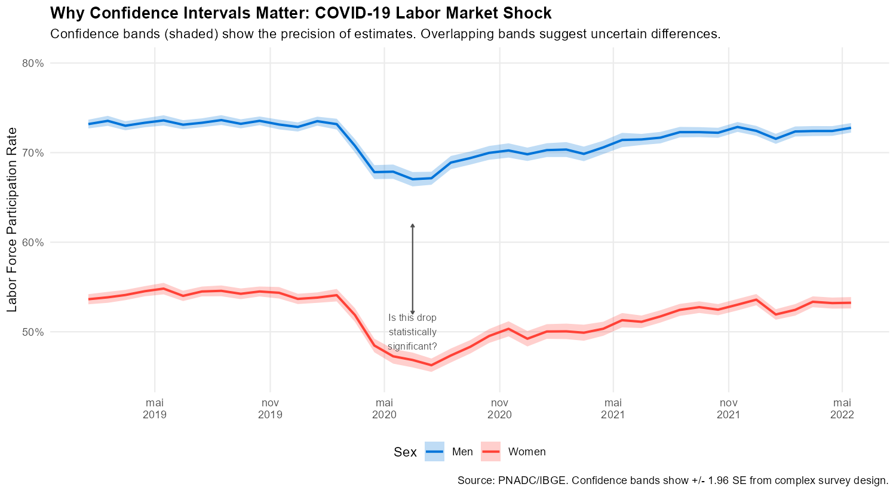
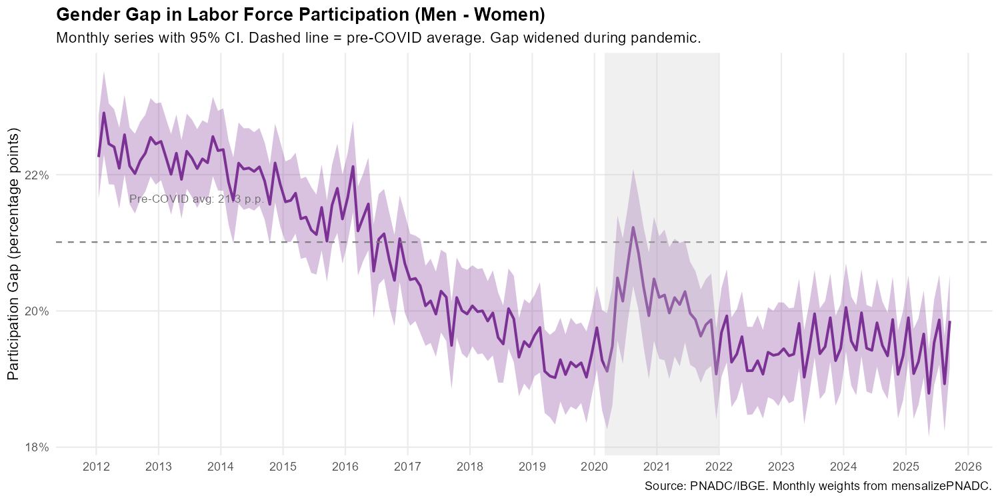

<!--
MAINTAINER NOTE:
The code chunks in this vignette must match the code in:
  mensalizacao_pnad/code/generate_complex_survey_figures.R

Look for comments like "# VIGNETTE CODE: chunk-name" in that script.
To regenerate figures, run that script. Changes to code here
must be mirrored in the generation script (and vice versa).
-->

```{r setup, include = FALSE}
knitr::opts_chunk$set(
  eval = FALSE,
  echo = TRUE,
  collapse = TRUE,
  comment = "#>",
  message = FALSE,
  warning = FALSE,
  fig.width = 10,
  fig.height = 6,
  purl = FALSE
)
```

## Introduction

When you compute a statistic from survey data---say, the unemployment rate is 7.2%---that number alone doesn't tell you much. Is 7.2% meaningfully different from last month's 7.0%? Could the true rate plausibly be 6.5% or 8.0%? Without **standard errors** and **confidence intervals**, you can't answer these questions. You're flying blind.

This matters especially when tracking changes over time. Monthly data from `mensalizePNADC` reveals dynamics hidden in quarterly averages, but those sharp month-to-month movements could be real economic changes or just sampling variability. Standard errors let you distinguish signal from noise.

The challenge is that PNADC uses a **complex sample design**. It's not a simple random sample where standard formulas apply. Instead, PNADC uses:

- **Stratification**: Households are grouped into strata (`Estrato`) before sampling
- **Clustering**: Within strata, census tracts (`UPA`) are sampled, then all eligible households in selected tracts are interviewed
- **Unequal probabilities**: Some groups are oversampled for better precision

Ignoring this design typically **underestimates** standard errors, sometimes dramatically. A naive analysis might claim statistically significant changes that are actually within the margin of error.

This vignette shows two strategies for proper variance estimation with the monthly weights from `mensalizePNADC`:

1. **Linearization approach**: Using design variables directly---simple and fast
2. **Replication weights approach**: Adjusting IBGE's 200 bootstrap weights---more computationally intensive but exact

We'll demonstrate both using a compelling example: the **gender gap in labor force participation**, which widened dramatically during COVID-19.

---

## Why Standard Errors Matter: A Visual Motivation

Before diving into methodology, let's see why this matters. The figure below shows labor force participation for men and women during the COVID-19 period. The **shaded bands** show 95% confidence intervals from proper complex survey analysis.

{width=100%}

Notice several things:

1. **Women's participation dropped more sharply** than men's---but the confidence bands help us assess whether this difference is statistically meaningful

2. **Some month-to-month changes look dramatic** but might be within sampling error. Without confidence intervals, we'd be tempted to over-interpret random fluctuations

3. **The recovery path** shows persistent gaps that confidence bands confirm are real, not noise

This is why you need standard errors: they transform raw numbers into actionable knowledge.

---

## Prerequisites

### Required Packages

```{r packages}
# Core packages
library(PNADCperiods)
library(data.table)

# Survey analysis
library(survey)       # For svydesign and linearization-based variance
library(srvyr)        # Tidyverse-friendly wrapper for survey

# Visualization
library(ggplot2)
library(scales)
```

### Required Variables

To implement complex survey analysis, your PNADC data needs specific design variables that are **not included in the minimal stacked data** used for basic mensalization. You need the **full quarterly microdata**:

| Variable | Description | Required for |
|----------|-------------|--------------|
| `Estrato` | Stratum identifier | Strategy 1 |
| `UPA` | Primary Sampling Unit (census tract) | Strategy 1 |
| `V1028` | Original IBGE weight | Both strategies |
| `V1028001`-`V1028200` | Bootstrap replication weights | Strategy 2 |
| `weight_monthly` | Monthly weight from `pnadc_apply_periods()` | Both strategies |

### Loading and Preparing Data

```{r load-data}
# Load stacked PNADC data with ALL required variables
# This needs: Ano, Trimestre, UPA, V1008, V1014, V2003, V2008, V20081, V20082, V2009
#             V1028, UF, posest, posest_sxi (for weight calibration)
#             Estrato (for Strategy 1)
#             V1028001-V1028200 (for Strategy 2)
#             Plus any analysis variables (VD4001, VD4002, V2007, etc.)

pnadc <- fread("path/to/your/pnadc_full_stacked.csv")

# Step 1: Build crosswalk (identify reference periods)
crosswalk <- pnadc_identify_periods(pnadc)

# Step 2: Apply crosswalk and calibrate weights
pnadc <- pnadc_apply_periods(pnadc, crosswalk,
                              weight_var = "V1028",
                              anchor = "quarter",
                              calibrate = TRUE)

# Filter to determined observations (those with monthly weights)
pnadc_monthly <- pnadc[!is.na(weight_monthly)]
```

---

## Strategy 1: Linearization with Strata and PSU

This approach uses **Taylor series linearization** to estimate variances. It's the standard method implemented in most survey software, fast to compute, and works well for means, proportions, totals, and ratios.

### Understanding the Survey Design

PNADC uses a two-stage stratified cluster sample:

- **Stage 1**: Within each stratum (`Estrato`), Primary Sampling Units (census tracts, `UPA`) are selected with probability proportional to size
- **Stage 2**: Within selected UPAs, households are systematically selected

The stratification improves precision by ensuring representation across geographic and demographic groups. But the clustering introduces correlation among observations within the same UPA, which typically *increases* variance compared to simple random sampling.

### Setting Up the Survey Design

```{r design-linearization}
# Create survey design object for a specific month
# Let's analyze January 2020 (ref_month_yyyymm = 202001)

pnadc_jan2020 <- pnadc_monthly[ref_month_yyyymm == 202001]

# Set up the survey design
design_jan2020 <- svydesign(
  ids = ~UPA,                    # PSU/cluster identifier
  strata = ~Estrato,             # Stratification variable
  weights = ~weight_monthly,     # Monthly-adjusted weight
  data = pnadc_jan2020,
  nest = TRUE                    # UPAs are nested within strata
)

# Check the design
summary(design_jan2020)
```

The `nest = TRUE` argument is important: it tells the survey package that UPA codes are only unique within strata, not across the entire dataset.

### Computing Estimates with Standard Errors

```{r estimates-linearization}
# Labor force participation rate (VD4001 == 1 means in labor force)
# Filter to working-age population (14+) first
design_14plus <- subset(design_jan2020, V2009 >= 14)

participation <- svymean(~I(VD4001 == 1), design_14plus, na.rm = TRUE)
print(participation)

# Get confidence interval
confint(participation, level = 0.95)

# Participation by sex (V2007: 1 = Male, 2 = Female)
participation_by_sex <- svyby(
  ~I(VD4001 == 1),
  by = ~V2007,
  design = design_14plus,
  FUN = svymean,
  na.rm = TRUE
)
print(participation_by_sex)
```

### Monthly Time Series with Confidence Intervals

To create a full monthly series, we loop over months and collect results:

```{r time-series-linearization}
# Function to compute participation rate for one month
compute_participation <- function(month_yyyymm, data) {

  month_data <- data[ref_month_yyyymm == month_yyyymm & V2009 >= 14]

  if (nrow(month_data) == 0) return(NULL)

  # Create survey design
  design <- svydesign(
    ids = ~UPA,
    strata = ~Estrato,
    weights = ~weight_monthly,
    data = month_data,
    nest = TRUE
  )

  # Compute overall participation
  result <- svymean(~I(VD4001 == 1), design, na.rm = TRUE)

  data.table(
    ref_month_yyyymm = month_yyyymm,
    participation = as.numeric(result),
    se = as.numeric(SE(result))
  )
}

# Get all unique months
months <- sort(unique(pnadc_monthly$ref_month_yyyymm))

# Compute for all months (this may take a few minutes)
results_list <- lapply(months, compute_participation, data = pnadc_monthly)
monthly_participation <- rbindlist(results_list)

# Add confidence intervals
monthly_participation[, `:=`(
  ci_lower = participation - 1.96 * se,
  ci_upper = participation + 1.96 * se,
  period = as.Date(paste0(ref_month_yyyymm %/% 100, "-",
                          ref_month_yyyymm %% 100, "-15"))
)]
```

---

## Strategy 2: Adjusted Replication Weights

IBGE provides 200 **bootstrap replication weights** (`V1028001` to `V1028200`) with each quarterly release. These weights are generated by resampling the original sample design and recalculating weights, capturing the full complexity of the survey design.

This approach is more computationally intensive (you compute your statistic 201 times: once with main weights, 200 times with replication weights), but it handles complex statistics like quantiles, Gini coefficients, and regression coefficients without requiring special variance formulas.

### The Adjustment Logic

The key insight is that `weight_monthly` is the product of the original weight `V1028` and adjustment factors from mensalization calibration. We apply the **same ratio** to each replication weight:

$$
\text{V1028}_k^{\text{monthly}} = \text{V1028}_k \times \frac{\text{weight\_monthly}}{\text{V1028}}
$$

where $k = 001, 002, \ldots, 200$ indexes the replication weights.

This preserves the variance properties of the replication weights while incorporating the mensalization adjustments.

### Creating Adjusted Replication Weights

```{r create-rep-weights}
# Calculate the adjustment ratio
pnadc_monthly[, weight_ratio := weight_monthly / V1028]

# Get names of replication weight columns
rep_weight_cols <- paste0("V1028", sprintf("%03d", 1:200))

# Create adjusted replication weight columns
for (col in rep_weight_cols) {
  new_col <- paste0(col, "_monthly")
  pnadc_monthly[, (new_col) := get(col) * weight_ratio]
}

# Verify the adjustment (the ratio should be constant within each observation)
cat("Ratio range:", range(pnadc_monthly$weight_ratio, na.rm = TRUE), "\n")
```

### Setting Up the Replicate Design

```{r design-replication}
# Create survey design with replication weights for January 2020
pnadc_jan2020_rep <- pnadc_monthly[ref_month_yyyymm == 202001]

# Get adjusted replication weight column names
rep_weight_cols_monthly <- paste0("V1028", sprintf("%03d", 1:200), "_monthly")

# Create replicate weights design
# type = "bootstrap" matches IBGE's methodology
design_rep_jan2020 <- svrepdesign(
  data = pnadc_jan2020_rep,
  weights = ~weight_monthly,
  repweights = rep_weight_cols_monthly,
  type = "bootstrap",
  combined.weights = TRUE     # The replication weights already include the base weight
)

summary(design_rep_jan2020)
```

### Computing Estimates with Replication Variance

```{r estimates-replication}
# Labor force participation rate
design_rep_14plus <- subset(design_rep_jan2020, V2009 >= 14)

participation_rep <- svymean(~I(VD4001 == 1), design_rep_14plus, na.rm = TRUE)
print(participation_rep)

# Compare with linearization estimate
cat("\nLinearization SE:", as.numeric(SE(participation)), "\n")
cat("Replication SE:", as.numeric(SE(participation_rep)), "\n")

# Participation by sex
participation_by_sex_rep <- svyby(
  ~I(VD4001 == 1),
  by = ~V2007,
  design = design_rep_14plus,
  FUN = svymean,
  na.rm = TRUE
)
print(participation_by_sex_rep)
```

---

## Practical Example: Gender Gap in Labor Force Participation

Brazil has one of the **largest gender gaps in labor force participation** among major economies. While about 73% of working-age men participate in the labor force, only about 53% of women do---a gap of roughly 20 percentage points that has persisted for decades.

This gap represents millions of potential workers who are not in the labor market, with profound implications for economic growth, household income inequality, and women's economic autonomy. Understanding how this gap evolves---and whether changes are statistically significant---is crucial for policy evaluation.

The COVID-19 pandemic provides a natural experiment. School closures and increased caregiving demands fell disproportionately on women. Did this widen the participation gap? Monthly data lets us track these dynamics precisely.

### Computing Monthly Series by Sex

```{r compute-gender-series}
# Prepare analysis data
pnadc_analysis <- pnadc_monthly[V2009 >= 14]
pnadc_analysis[, in_labor_force := fifelse(VD4001 == 1, 1L, 0L)]
pnadc_analysis[, sex := fifelse(V2007 == 1, "Men", "Women")]

# Function to compute participation by sex for one month
compute_participation_by_sex <- function(month_yyyymm, data) {

  month_data <- data[ref_month_yyyymm == month_yyyymm]

  if (nrow(month_data) == 0) return(NULL)

  # Create survey design
  design <- svydesign(
    ids = ~UPA,
    strata = ~Estrato,
    weights = ~weight_monthly,
    data = month_data,
    nest = TRUE
  )

  # Compute participation by sex
  result <- svyby(
    ~in_labor_force,
    by = ~sex,
    design = design,
    FUN = svymean,
    na.rm = TRUE,
    vartype = c("se", "ci")
  )

  setDT(result)
  result[, ref_month_yyyymm := month_yyyymm]

  result
}

# Compute for all months
months <- sort(unique(pnadc_analysis$ref_month_yyyymm))
results_by_sex <- rbindlist(lapply(months, compute_participation_by_sex, data = pnadc_analysis))

# Rename columns for clarity
setnames(results_by_sex,
         c("in_labor_force", "se", "ci_l", "ci_u"),
         c("participation", "se", "ci_lower", "ci_upper"))

# Add date column for plotting
results_by_sex[, period := as.Date(paste0(
  ref_month_yyyymm %/% 100, "-",
  ref_month_yyyymm %% 100, "-15"
))]
```

### Visualizing the Gender Gap with Confidence Bands

```{r plot-gender-gap, fig.width=10, fig.height=6}
# Create the plot
ggplot(results_by_sex, aes(x = period, y = participation, color = sex, fill = sex)) +

  # Confidence bands
  geom_ribbon(aes(ymin = ci_lower, ymax = ci_upper), alpha = 0.2, color = NA) +

  # Point estimates
  geom_line(linewidth = 0.8) +

  # Highlight COVID period
  annotate("rect",
           xmin = as.Date("2020-03-01"), xmax = as.Date("2021-12-31"),
           ymin = -Inf, ymax = Inf,
           fill = "gray80", alpha = 0.3) +
  annotate("text",
           x = as.Date("2021-01-01"), y = 0.85,
           label = "COVID-19", fontface = "italic", size = 3, color = "gray40") +

  # Scales and labels
  scale_y_continuous(
    labels = percent_format(accuracy = 1),
    limits = c(0.45, 0.85),
    breaks = seq(0.45, 0.85, 0.05)
  ) +
  scale_x_date(date_breaks = "1 year", date_labels = "%Y") +
  scale_color_manual(values = c("Men" = "#0074D9", "Women" = "#FF4136")) +
  scale_fill_manual(values = c("Men" = "#0074D9", "Women" = "#FF4136")) +

  labs(
    title = "Labor Force Participation by Sex: Monthly Series with 95% Confidence Intervals",
    subtitle = "Brazil, 2012-2024. Shaded regions show 95% confidence bands from complex survey design.",
    x = NULL,
    y = "Labor Force Participation Rate",
    color = "Sex",
    fill = "Sex",
    caption = "Source: PNADC/IBGE. Monthly weights from mensalizePNADC. Variance estimated via Taylor linearization."
  ) +

  theme_minimal(base_size = 11) +
  theme(
    plot.title = element_text(face = "bold"),
    legend.position = "bottom",
    panel.grid.minor = element_blank()
  )
```

{width=100%}

The figure reveals several important patterns:

1. **The gender gap is persistent and large**: Men's participation hovers around 73%, women's around 53%---a 20 percentage-point gap

2. **COVID-19 hit women harder**: Women's participation dropped from ~53% to below 47% during the pandemic, while men's dropped from ~73% to ~66%

3. **The confidence bands confirm these are real differences**: The bands for men and women never overlap, meaning the gender gap is statistically significant in every single month

4. **Recovery was uneven**: Both series recovered by late 2021, but examining the gap itself tells a more nuanced story

### Computing the Gender Gap with Standard Errors

The gender gap is a derived statistic: the difference between two survey estimates. We need the standard error of this difference:

```{r compute-gap}
# Function to compute the gender gap for one month
compute_gender_gap <- function(month_yyyymm, data) {

  month_data <- data[ref_month_yyyymm == month_yyyymm]

  if (nrow(month_data) == 0) return(NULL)

  design <- svydesign(
    ids = ~UPA,
    strata = ~Estrato,
    weights = ~weight_monthly,
    data = month_data,
    nest = TRUE
  )

  # Compute participation by sex
  by_sex <- svyby(~in_labor_force, ~sex, design, svymean, na.rm = TRUE)

  # Extract values
  men_rate <- coef(by_sex)["Men"]
  women_rate <- coef(by_sex)["Women"]

  # The variance of (Men - Women) = Var(Men) + Var(Women) - 2*Cov(Men, Women)
  # For independent samples, Cov ≈ 0, so SE(gap) ≈ sqrt(SE_men^2 + SE_women^2)
  se_men <- SE(by_sex)["Men"]
  se_women <- SE(by_sex)["Women"]
  se_gap <- sqrt(se_men^2 + se_women^2)

  data.table(
    ref_month_yyyymm = month_yyyymm,
    gap = men_rate - women_rate,
    se = se_gap,
    men_rate = men_rate,
    women_rate = women_rate
  )
}

# Compute for all months
gap_results <- rbindlist(lapply(months, compute_gender_gap, data = pnadc_analysis))

# Add confidence intervals and date
gap_results[, `:=`(
  ci_lower = gap - 1.96 * se,
  ci_upper = gap + 1.96 * se,
  period = as.Date(paste0(ref_month_yyyymm %/% 100, "-", ref_month_yyyymm %% 100, "-15"))
)]
```

### Visualizing the Gender Gap Over Time

```{r plot-gap, fig.width=10, fig.height=5}
ggplot(gap_results, aes(x = period, y = gap)) +

  # Confidence band
  geom_ribbon(aes(ymin = ci_lower, ymax = ci_upper),
              fill = "#7b3294", alpha = 0.3) +

  # Point estimate
  geom_line(color = "#7b3294", linewidth = 0.9) +

  # Reference line at pre-COVID average
  geom_hline(
    yintercept = gap_results[period < "2020-03-01", mean(gap)],
    linetype = "dashed", color = "gray50"
  ) +

  # Highlight COVID period
  annotate("rect",
           xmin = as.Date("2020-03-01"), xmax = as.Date("2021-12-31"),
           ymin = -Inf, ymax = Inf,
           fill = "gray80", alpha = 0.3) +

  # Scales and labels
  scale_y_continuous(
    labels = percent_format(accuracy = 1),
    breaks = seq(0.15, 0.30, 0.025)
  ) +
  scale_x_date(date_breaks = "1 year", date_labels = "%Y") +

  labs(
    title = "Gender Gap in Labor Force Participation (Men - Women)",
    subtitle = "Monthly series with 95% CI. Dashed line = pre-COVID average. Gap widened during pandemic.",
    x = NULL,
    y = "Participation Gap (percentage points)",
    caption = "Source: PNADC/IBGE. Monthly weights from mensalizePNADC."
  ) +

  theme_minimal(base_size = 11) +
  theme(
    plot.title = element_text(face = "bold"),
    panel.grid.minor = element_blank()
  )
```

{width=100%}

This figure tells a clear story:

1. **Pre-COVID**: The gap was stable around 20 percentage points (dashed line)

2. **During COVID**: The gap **widened significantly** to about 22-23 percentage points---and the confidence bands confirm this widening was statistically significant, not sampling noise

3. **Post-COVID**: The gap returned to approximately pre-pandemic levels by 2022

The confidence bands are crucial here. Without them, we might dismiss the 2-3 percentage point increase during COVID as noise. With them, we can confidently say the pandemic disproportionately pushed women out of the labor force.

---

## Comparing the Two Strategies

Both strategies produce similar standard error estimates for simple statistics like means and proportions. Here's when to use each:

| Aspect | Strategy 1 (Linearization) | Strategy 2 (Replication) |
|--------|---------------------------|-------------------------|
| **Setup complexity** | Simpler | More complex |
| **Computation time** | Faster | Slower (200× calculations) |
| **Memory usage** | Lower | Higher (200 extra columns) |
| **Complex statistics** | May need special formulas | Handles automatically |
| **Consistency with IBGE** | Approximate | Exact match |
| **Best for** | Routine analysis | Publication-quality results |

**Recommendation**: Use Strategy 1 for exploratory analysis and most routine work. Use Strategy 2 when:

- You need exact consistency with IBGE's official standard errors
- You're computing complex statistics (quantiles, Gini, regression coefficients)
- You're preparing results for publication or official reports

---

## Important Considerations

### Design Effects and Effective Sample Size

The complex sample design affects precision. You can examine the **design effect** (deff), which measures how much larger the variance is compared to a simple random sample:

```{r deff}
# Compute design effect for participation rate
deff(svymean(~I(VD4001 == 1), design_14plus, na.rm = TRUE, deff = TRUE))

# Design effect > 1 means clustering/stratification increased variance
# Design effect < 1 means stratification improved precision
```

For PNADC, design effects typically range from 1.5 to 3.0 for national estimates, meaning you'd need 1.5-3x as many observations in a simple random sample to achieve the same precision.

### Handling Singleton Strata

Some months may have strata with only one PSU (singleton strata), which causes problems for variance estimation. The `survey` package handles this with several options:

```{r singleton}
# Set option for handling singleton strata
options(survey.lonely.psu = "adjust")  # Recommended: conservative adjustment

# Other options:
# "remove" - drop singleton strata from variance calculation
# "average" - use average variance contribution
# "certainty" - treat as certainty selections (SE = 0)
```

The `"adjust"` option is recommended as it provides conservative (larger) standard errors.

### Subpopulation Analysis

When analyzing subgroups, **always subset the design object**, not the raw data:

```{r subpop}
# CORRECT: Subset the design
design_women <- subset(design_14plus, V2007 == 2)
svymean(~I(VD4001 == 1), design_women, na.rm = TRUE)

# INCORRECT: Don't do this - loses design information
# bad_design <- svydesign(..., data = pnadc[V2007 == 2])
```

Subsetting the data before creating the design object loses information about the full sample structure, leading to incorrect variance estimates.

---

## Using srvyr for Tidyverse-Style Analysis

If you prefer tidyverse syntax, the `srvyr` package wraps the `survey` package with dplyr verbs:

```{r srvyr-example}
library(srvyr)

# Convert to srvyr design
design_srvyr <- pnadc_jan2020 %>%
  filter(V2009 >= 14) %>%
  as_survey_design(
    ids = UPA,
    strata = Estrato,
    weights = weight_monthly,
    nest = TRUE
  )

# Compute participation by sex using dplyr verbs
participation_srvyr <- design_srvyr %>%
  mutate(sex = if_else(V2007 == 1, "Men", "Women"),
         in_lf = VD4001 == 1) %>%
  group_by(sex) %>%
  summarise(
    participation = survey_mean(in_lf, na.rm = TRUE, vartype = "ci")
  )

print(participation_srvyr)
```

---

## Summary

This vignette demonstrated two approaches for computing standard errors with monthly PNADC weights from `PNADCperiods`:

1. **Strategy 1 (Linearization)**: Use `Estrato` as strata, `UPA` as PSU, and `weight_monthly` as the weight in a standard survey design. Fast, simple, works for most statistics.

2. **Strategy 2 (Replication)**: Multiply each of the 200 bootstrap replication weights by `weight_monthly / V1028` to create adjusted replication weights. More intensive but exact.

The practical example demonstrated that the **gender gap in labor force participation widened significantly during COVID-19**---a finding that would be impossible to assess properly without standard errors. The confidence bands transformed a claim like "the gap looks bigger" into "the gap increased by 2-3 percentage points, and we're 95% confident it's real."

Monthly data without standard errors is like a dashboard with all the warning lights burned out. You can see the numbers, but you can't tell which changes matter.

---

## Further Reading

- [Get Started](getting-started.html) - Basic mensalization workflow
- [How It Works](how-it-works.html) - Algorithm details and weight calibration methodology
- [Applied Examples](applied-examples.html) - More applications of monthly data
- Thomas Lumley (2010). *Complex Surveys: A Guide to Analysis Using R*. Wiley.
- IBGE. *Notas Metodologicas da PNAD Continua*.
