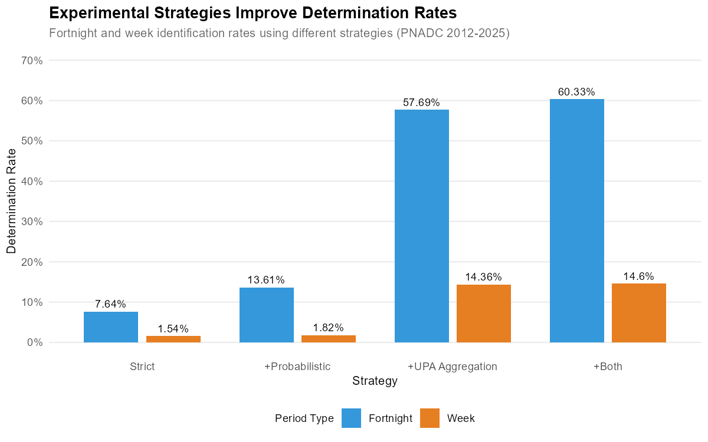

<!--
MAINTAINER NOTE:
This vignette uses eval=FALSE for all code chunks.
Pre-computed figures and tables are generated by:
  code/generate_how_it_works_figures.R

Figures are stored in: vignettes/figures/how-it-works/
Tables are stored in: output/vignette/tables/how-it-works/

To regenerate, run the generation script. The script caches intermediate
results in data/processed/ for faster subsequent runs.
-->

```{r, include = FALSE}
knitr::opts_chunk$set(
  collapse = TRUE,
  comment = "#>",
  eval = FALSE,
  purl = FALSE
)
```

## Introduction

This vignette explains **how the PNADCperiods algorithm works**: the methodology behind converting Brazil's quarterly PNADC survey into sub-quarterly time series with calibrated weights. For practical usage examples, see the [Get Started](getting-started.html) vignette.

### What This Package Does

The `PNADCperiods` package transforms Brazil's quarterly PNADC (Pesquisa Nacional por Amostra de Domicilios Continua) survey data into finer-grained time series for labor market, demographic, and socioeconomic analysis. It addresses a fundamental challenge: PNADC reports quarterly aggregates, but policy analysis often requires understanding what happened within specific months, fortnights, or weeks.

**Package capabilities:**

1. **Multi-granularity period identification**: Determines which specific time period each observation refers to
   - **Monthly** (~97% determination rate) - suitable for most analyses
   - **Fortnight** (~7% strict, up to 60% with experimental strategies) - for short-term analysis
   - **Weekly** (~1.5% strict, up to 15% with experimental strategies) - for high-frequency monitoring

2. **Flexible weight calibration**: Adjusts survey weights for sub-quarterly estimates
   - Calibrates to official monthly population totals (SIDRA API)
   - Adaptive hierarchical raking (4/2/1 cell levels depending on sample size)
   - Adaptive smoothing to remove quarterly artifacts (3/7/none periods)

3. **Dual data format support**: Works with both quarterly and annual PNADC releases
   - **Quarterly data** (V1028 weights) - labor market variables, all rotation groups
   - **Annual data** (V1032 weights) - comprehensive income (VD5008), single visit

### Why This Matters

Policy questions often require sub-quarterly precision that raw PNADC data cannot provide:

- When exactly did unemployment spike during COVID-19? (March 2020 vs. January 2020)
- How quickly did labor markets respond to minimum wage changes? (month-to-month transitions)
- What was poverty in December 2023 specifically? (not just Q4 2023 average)

The algorithm exploits PNADC's rotating panel design and birthday information to recover this temporal precision. By identifying when each household was actually interviewed within the quarter, we can construct monthly time series with 97% of the original sample retained.

### What You'll Learn

This vignette walks through the complete methodology:

1. **Why stacked multi-quarter data matters** - How cross-quarter aggregation improves determination from ~70% to ~97%
2. **The core algorithm** (8-step pipeline):
   - Valid interview date calculation (IBGE timing rules)
   - Birthday constraints to narrow date ranges
   - UPA-panel aggregation (households interviewed together)
   - Cross-quarter constraint propagation
   - Dynamic exception detection for edge cases
3. **Nested identification hierarchy** - How fortnights require months, and weeks require fortnights
4. **Experimental strategies** for improved fortnight/week determination:
   - Probabilistic assignment for narrow date ranges
   - UPA aggregation leveraging 100% homogeneity finding
5. **Weight calibration approaches**:
   - Quarterly data: redistribute quarterly totals across 3 months
   - Annual data: redistribute yearly totals across 12 months
   - Fortnight/weekly data: simplified raking for smaller samples
6. **Performance characteristics** - Determination rates, processing speed, data quality
7. **Best practices** - Input data requirements, handling indeterminate cases, validation

### Prerequisites

This vignette assumes you're already familiar with basic PNADC concepts (UPA, rotation groups, survey weights) and have seen the package in action via the [Get Started](getting-started.html) vignette. We focus here on **understanding the methodology** rather than **how to use the functions**.

If you're looking for applied examples with real policy questions, see the [Applied Examples](applied-examples.html) vignette. For poverty analysis using annual PNADC data, see [Annual Poverty Analysis](annual-poverty-analysis.html).

---

## Quick Reference

### Required Input Variables

**Minimum (for reference month identification):**

| Column | Description |
|--------|-------------|
| `Ano` | Survey year |
| `Trimestre` | Quarter (1-4) |
| `UPA` | Primary Sampling Unit |
| `V1014` | Panel identifier |
| `V1008` | Household identifier |
| `V2008` | Birth day (1-31, or 99 for unknown) |
| `V20081` | Birth month (1-12, or 99 for unknown) |
| `V20082` | Birth year (or 9999 for unknown) |
| `V2009` | Age |

**Additional (for `calibrate = TRUE` in `pnadc_apply_periods()`):**

| Variable | Description |
|----------|-------------|
| `V1028` | Original quarterly survey weight |
| `V1032` | Original annual survey weight (for annual data only) |
| `UF` | State code |
| `posest` | Post-stratification cell |
| `posest_sxi` | Post-stratification group |
| `V2003` | Person order in household (optional, used for sex-specific calibration) |

### Output Variables

The crosswalk returned by `pnadc_identify_periods()` contains IBGE calendar-based output columns:

**Month columns:**

| Variable | Type | Description |
|----------|------|-------------|
| `ref_month_start` | Date | First day (Sunday) of the IBGE reference month |
| `ref_month_end` | Date | Last day (Saturday) of the IBGE reference month |
| `ref_month_weeks` | Integer | Number of weeks in the reference month (4 or 5) |
| `ref_month_in_quarter` | Integer | Position: 1, 2, 3, or NA if indeterminate |
| `ref_month_yyyymm` | Integer | YYYYMM format (e.g., 202301) |
| `determined_month` | Logical | TRUE if month is definitively determined |

**Fortnight columns:**

| Variable | Type | Description |
|----------|------|-------------|
| `ref_fortnight_start` | Date | First day (Sunday) of the reference fortnight |
| `ref_fortnight_end` | Date | Last day (Saturday) of the reference fortnight |
| `ref_fortnight_in_quarter` | Integer | Position: 1-6, or NA if indeterminate |
| `ref_fortnight_yyyyff` | Integer | YYYYFF format (e.g., 202303 = 3rd fortnight of 2023) |
| `determined_fortnight` | Logical | TRUE if fortnight is definitively determined |

**Week columns:**

| Variable | Type | Description |
|----------|------|-------------|
| `ref_week_start` | Date | First day (Sunday) of the reference week |
| `ref_week_end` | Date | Last day (Saturday) of the reference week |
| `ref_week_in_quarter` | Integer | Position: 1-13, or NA if indeterminate |
| `ref_week_yyyyww` | Integer | YYYYWW format (e.g., 202315) |
| `determined_week` | Logical | TRUE if week is definitively determined |

**After applying `pnadc_apply_periods()` with `calibrate = TRUE`:**

| Variable | Type | Description |
|----------|------|-------------|
| `weight_monthly` | Numeric | Monthly calibrated weight; NA for indeterminate |
| `weight_fortnight` | Numeric | Fortnight calibrated weight (if `calibration_unit = "fortnight"`) |
| `weight_weekly` | Numeric | Weekly calibrated weight (if `calibration_unit = "week"`) |

### Functions

| Function | Description |
|----------|-------------|
| `pnadc_identify_periods()` | Main function: build crosswalk with months/fortnights/weeks |
| `pnadc_apply_periods()` | Apply crosswalk + calibrate weights (quarterly or annual) |
| `pnadc_experimental_periods()` | Experimental strategies for improved fortnight/week determination |
| `identify_reference_month()` | Standalone reference month identification |
| `identify_reference_fortnight()` | Standalone fortnight (quinzena) identification |
| `identify_reference_week()` | Standalone week identification |
| `fetch_monthly_population()` | Fetch population from SIDRA API |
| `validate_pnadc()` | Input data validation |

### Performance Summary

| Metric | Result |
|--------|--------|
| Monthly determination rate | **~97%** (full history, 2012-2025) |
| Fortnight determination rate (strict) | **~7%** |
| Weekly determination rate (strict) | **~1.5%** |
| Processing time (basic mode) | **~2.5 minutes** for 28.4M rows (~177,000 rows/sec) |
| Processing time (with weights) | **~5 minutes** |
| Best period (2013-2019) | 97-99% monthly determination |
| COVID period (2020-2021) | 93-96% monthly determination |

### Experimental Strategies Summary

The package includes experimental strategies to improve fortnight and week determination for sensitivity analysis. These are accessed via `pnadc_experimental_periods()`:

| Strategy | Fortnight Rate | Week Rate | Notes |
|----------|----------------|-----------|-------|
| Strict (default) | ~7% | ~1.5% | Definitive determinations only |
| + Probabilistic | ~13-14% | ~2% | Adds probability-weighted assignments |
| + UPA Aggregation | ~57-58% | ~14-15% | Leverages 100% UPA homogeneity |
| + Both | **~60%** | **~15%** | Maximum coverage |

See the [Experimental Strategies](#experimental-strategies) section for details.

---

## Why Stacked Data Matters

The algorithm achieves **~97% determination rate** when processing **stacked multi-quarter data**. If you process quarters individually, you'll only get ~73% determination.

The figure below shows how determination rate improves as more quarters are stacked, computed from real PNADC data (2012-2025):

{width=100%}

**Empirical determination rates by number of quarters stacked** (from real PNADC 2012-2025 data):

| Quarters Stacked | Observations | Determination Rate |
|------------------|--------------|-------------------|
| 1 (single quarter) | 566,873 | 73.0% |
| 2 | 1,133,889 | 88.2% |
| 4 (1 year) | 2,252,464 | 93.9% |
| 8 (2 years) | 4,530,641 | 96.3% |
| 12 (3 years) | 6,828,144 | 97.1% |
| 20 (5 years) | 11,391,346 | 97.3% |
| 32 (8 years) | 18,088,581 | **97.4%** |
| 55 (full history) | 28,395,273 | 97.0% |

Note that the rate peaks around 32 quarters and then stabilizes. This occurs because the boundary quarters (first 4 and last 4 of any series) have inherently lower rates due to incomplete panel coverage.

**Why does stacking help?** PNADC uses a **rotating panel** where each household (UPA + V1014) is interviewed for 5 consecutive quarters. Crucially, the same household is always interviewed in the **same relative month position** (always month 1, always month 2, or always month 3).

This means birthday constraints from **any quarter** can determine the month for **all quarters**:

```
UPA=123456, V1014=1 appears in 5 quarters:

  2023-Q1: month_min=1, month_max=2 (ambiguous: Jan or Feb)
  2023-Q2: month_min=1, month_max=3 (ambiguous: Apr, May, or Jun)
  2023-Q3: month_min=2, month_max=2 (DETERMINED: August)  <- Birthday constraint!
  2023-Q4: month_min=1, month_max=2 (ambiguous: Oct or Nov)
  2024-Q1: month_min=2, month_max=3 (ambiguous: Feb or Mar)

Cross-quarter aggregation:
  upa_month_min = max(1, 1, 2, 1, 2) = 2
  upa_month_max = min(2, 3, 2, 2, 3) = 2

Result: ALL 5 quarters -> ref_month_in_quarter = 2
```

**Recommended**: Stack at least 2 years (8 quarters) of data before calling `pnadc_identify_periods()` to achieve >96% determination.

---

## The Algorithm Explained

This section details how the package identifies reference periods (months, fortnights, and weeks) for each observation. The algorithm shares initial computation steps across all three period types, then diverges based on each period's aggregation scope.

### Overview Diagram

The reference period identification follows a pipeline with shared initial steps and period-specific aggregation:

```
+-----------------------------------------------------------------------------+
|                    REFERENCE PERIOD IDENTIFICATION PIPELINE                  |
|                       (Months, Fortnights, and Weeks)                        |
+-----------------------------------------------------------------------------+

INPUTS (per observation):
+--------------+  +--------------+  +--------------+  +--------------+
|     Year     |  |    Quarter   |  |    Birthday  |  |      Age     |
|    (Ano)     |  |  (Trimestre) |  |  (V2008/1/2) |  |    (V2009)   |
+--------------+  +--------------+  +--------------+  +--------------+
        |                |                  |                 |
        +----------------+------------------+-----------------+
                                    |
                                    v
+-----------------------------------------------------------------------------+
|                        SHARED COMPUTATION (All Periods)                      |
+-----------------------------------------------------------------------------+
|                                                                              |
|  STEP 1: Calculate Valid Interview Saturdays (IBGE Rules)                    |
|          Output: date_min, date_max for each quarter                         |
|                                                                              |
|  STEP 2: Apply Birthday Constraints                                          |
|          Narrow date window using age vs birth year comparison               |
|                                                                              |
|  STEP 3: Convert Dates to Period Positions                                   |
|          Compute: month_min/max, fortnight_min/max, week_min/max             |
|                                                                              |
+-----------------------------------------------------------------------------+
                                    |
                                    v
+-----------------------------------------------------------------------------+
|               NESTED IDENTIFICATION (enforced by construction)               |
+-----------------------------------------------------------------------------+
|                                                                              |
|  PHASE 1: MONTH PIPELINE (Steps 4-7)                                         |
|  |-- Step 4: Aggregate at (UPA, V1014) level                                 |
|  |-- Step 5: CROSS-QUARTER aggregation across ALL quarters                   |
|  |-- Step 6: Dynamic exception detection                                     |
|  +-- Step 7: Final month assignment                                          |
|  +-- Determination: ~97%                                                     |
|                         |                                                    |
|                         v (only if month determined)                         |
|  PHASE 2: FORTNIGHT PIPELINE                                                 |
|  |-- Step 4: Aggregate at (Ano, Trimestre, UPA, V1008) level                 |
|  |-- NO cross-quarter aggregation possible                                   |
|  +-- Step 5: Final fortnight assignment                                      |
|  +-- Determination: ~7% (strict)                                           |
|                         |                                                    |
|                         v (only if fortnight determined)                     |
|  PHASE 3: WEEK PIPELINE                                                      |
|  |-- Step 4: Aggregate at (Ano, Trimestre, UPA, V1008) level                 |
|  |-- NO cross-quarter aggregation possible                                   |
|  +-- Step 5: Final week assignment                                           |
|  +-- Determination: ~1.5% (strict)                                           |
|                                                                              |
+-----------------------------------------------------------------------------+
                                    |
                                    v
+-----------------------------------------------------------------------------+
| OUTPUT (IBGE calendar-based):                                                |
| - Month:     ref_month_start/end (Date), ref_month_weeks, ref_month_yyyymm   |
| - Fortnight: ref_fortnight_start/end (Date), ref_fortnight_yyyyff            |
| - Week:      ref_week_start/end (Date), ref_week_yyyyww                      |
| - Flags:     determined_month, determined_fortnight, determined_week         |
+-----------------------------------------------------------------------------+
```

**Key insight**: The identification is **nested by construction** - fortnights can only be identified if the month is already determined, and weeks can only be identified if the fortnight is already determined. This guarantee is built into the algorithm, not enforced by post-hoc cleanup. Additionally, **months benefit from cross-quarter aggregation** (Step 5), while fortnights and weeks cannot aggregate constraints across quarters. This explains why the monthly determination rate (~97%) far exceeds fortnights (~7% strict) and weeks (~1.5% strict).

---

### Shared Computation (Steps 1-3)

The following three steps are computed once and shared across all period types (months, fortnights, and weeks).

#### Step 1: Valid Interview Saturdays (IBGE Rules)

IBGE defines that a reference week belongs to a month only if it has at least **4 days within that month**. Since reference weeks end on Saturdays, we examine the Saturdays of each month to determine valid interview dates.

**How we calculate the first valid Saturday:**

```
first_saturday_day = day of the first Saturday of the month
if first_saturday_day >= 4:
    use this Saturday (it has enough days in the month)
else:
    use the second Saturday (first_saturday_day + 7)
```

**Example for Q1 2023:**

```
JANUARY 2023:
  Sun  Mon  Tue  Wed  Thu  Fri  SAT
   1    2    3    4    5    6   [7]  <- First Saturday is day 7
                                     7 >= 4? YES -> Valid! (7 days in January)

FEBRUARY 2023:
  Wed  Thu  Fri  SAT  ...
   1    2    3   [4]              <- First Saturday is day 4
                                  4 >= 4? YES -> Valid! (4 days in February)

APRIL 2023:
  SAT  Sun  Mon  Tue  ...
  [1]   2    3    4              <- First Saturday is day 1
                                  1 >= 4? NO -> Skip to second Saturday!
  Fri  SAT  Sun  ...
   7   [8]   9                   <- Use day 8 instead
```

The valid Saturday calculation defines the **possible interview date range** for the quarter:
- `date_min` = First valid Saturday of Month 1
- `date_max` = First valid Saturday of Month 3 + 21 days

---

### Step 2: Birthday Constraints

IBGE calculates age precisely using the exact birthdate and the interview reference date (most persons report birthdates). In other words, IBGE **calculates age on the Saturday** that ends the reference week of the interview.

By comparing the calculated age to the birth year, we can determine whether the interview (i.e., the reference date) occurred before or after the person's birthday that year. This allows us to further narrow down the possible interview date window.

```
visit_before_birthday = (Survey_Year - Birth_Year) - Calculated_Age

If = 0: Interview was AFTER birthday (person already celebrated this year)
If = 1: Interview was BEFORE birthday (birthday hasn't happened yet)
```

**Example: Interview AFTER birthday**

```
Person: Born March 15, 1990
Survey Year and quarter: 2023 Q1
Calculated Age: 33

Check age: 2023 - 1990 = 33
           33 - 33 = 0  -> Interview was AFTER March 15, 2023

Check first Saturday on or after birthday:
           first_Saturday_on_or_after(March 15) = March 18, 2023

New date constraints:
            date_min = max(date_min, first_Saturday_on_or_after(March 15))
            date_min = max(Jan 7, March 18) = March 18

This person can only have been interviewed in MARCH (Month 3 of Q1).
```

**Example: Interview BEFORE birthday**

```
Person: Born February 17, 1990
Survey Year and quarter: 2023 Q1
Calculated Age: 32

Check age: 2023 - 1990 = 33
           33 - 32 = 1  -> Interview was BEFORE February 17, 2023

Check first Saturday on or after birthday:
           first_Saturday_on_or_after(February 17) = February 18, 2023 (Sat)
           Saturday_before = February 18 - 7 = February 11, 2023

Constraint: date_max = min(date_max, Saturday_before(birthday))
            date_max = min(March 25, February 11) = February 11

This person can only have been interviewed in JANUARY or early FEBRUARY.
```

**Unknown birthdays**: When V2008=99, V20081=99, or V20082=9999, that person's birthday cannot constrain the date. However, they may still be determined through aggregation at the UPA-Panel level (Step 4) or cross-quarter aggregation (Step 5).

---

### Step 3: Date to Period Position

Transform the date window [date_min, date_max] into period positions. This step works similarly for all three granularities:

**Month positions (1, 2, or 3):**

```
For date_min: if day <= 3 AND not in first month of quarter:
              subtract 1 from month position

For date_max: if day <= 3:
              use the month of (date - 3 days) instead
```

**Boundary handling**: Interviews on days 1-3 of a month typically belong to a reference week that started in the previous month.

**Fortnight positions (1-6):**

After determining the month position, fortnights are calculated as:
```
fortnight_pos = (month_pos - 1) * 2 + half_of_month
  where half_of_month = 1 if day <= 15, else 2
```

| Month | Days 1-15 | Days 16-31 |
|-------|-----------|------------|
| 1 | Fortnight 1 | Fortnight 2 |
| 2 | Fortnight 3 | Fortnight 4 |
| 3 | Fortnight 5 | Fortnight 6 |

**Week positions (IBGE calendar):**

Weeks follow the IBGE calendar convention where weeks run **Sunday to Saturday**. The first week of a month must have at least 4 days in that month:

```
For each date:
  ref_week_yyyyww = Year * 100 + week_number_in_year

IBGE weeks:
- Start on Sunday, end on Saturday
- First week of month must have >= 4 days in that month
- Reference months contain either 4 or 5 complete weeks
```

The resulting period positions feed into Step 4 (aggregation), which differs by period type. See the separate pipelines below for months, fortnights, and weeks.

---

### Month Identification Pipeline (Steps 4-7)

The month identification pipeline uses cross-quarter aggregation to achieve ~97% determination. This high rate is possible because the same UPA-V1014 panel group is always interviewed in the same relative month across all their quarterly visits.

#### Step 4: UPA-Panel Aggregation

All people in the same **UPA + V1014** are interviewed together in the **same reference month**. Take the intersection:

```
upa_month_min = MAX of all individual month_min_pos
upa_month_max = MIN of all individual month_max_pos
```

**Example:**

```
A household located at UPA=123456 and member of the Panel group V1014=1 has 3 members:

Person A: month_min=1, month_max=2 (could be Jan or Feb)
Person B: month_min=1, month_max=3 (could be Jan, Feb, or Mar)
Person C: month_min=2, month_max=3 (could be Feb or Mar)

Aggregation:
  upa_month_min = max(1, 1, 2) = 2
  upa_month_max = min(2, 3, 3) = 2

Result: min=2, max=2 -> Reference month is FEBRUARY!

Visual:
              Jan    Feb    Mar
Person A:     [=========]
Person B:     [============]
Person C:            [========]
Intersection:        [==]      <- Only February satisfies all
```

**Note**: Fortnights and weeks use a different aggregation key - see the Fortnight and Week Identification section below.

#### Step 5: Cross-Quarter Aggregation

Since the relative month position is constant across quarters, constraints from **any** quarter apply to **all** quarters:

```
For each (UPA, V1014) group across ALL quarters:
  upa_month_min = MAX of all month_min_pos from all quarters
  upa_month_max = MIN of all month_max_pos from all quarters
```

This is why processing stacked data improves determination from ~70% to ~97%.

**Critical distinction**: This cross-quarter aggregation is what makes monthly determination so effective (~97%), but it **cannot be applied to fortnights or weeks**. Even though a household is always interviewed in the same relative month (e.g., always month 2), the specific fortnight or week within that month varies by quarter. Therefore, fortnight and week constraints must be evaluated within each quarter independently, resulting in much lower determination rates (~7% for fortnights, ~1.5% for weeks).

#### Step 6: Dynamic Exception Detection

In some quarters, the standard rule (first reference week with at least 4 days) may produce impossible results, such as `upa_month_min > upa_month_max`. Quarters in which this happens are flagged as needing an exception. We then implement an **alternative rule**: first reference week with at least 3 days.

**How dynamic detection works**: The algorithm calculates month positions using both rules simultaneously:

| Rule | First reference week | Day Threshold |
|------|----------------------|---------------|
| Standard | >=4 days in month | day <= 3 |
| Alternative | >=3 days in month | day <= 2 |

Exceptions are detected and applied at the month level within each quarter. For example, in 2016q3, only month 3 (September) needs the exception - months 1 and 2 use the standard rule. Here's why: under the standard rule, September's first valid Saturday would be September 10th (since September 3rd has only 3 days in the month). But some UPA-V1014 groups have constraints that require September 3rd to be valid. The exception rule (>=3 days instead of >=4) makes September 3rd valid for these groups, assigning the week of August 28th-September 3rd to September's reference month rather than August's.

The algorithm proceeds as follows:

```
For each UPA-V1014:
  1. Calculate upa_month_min/max using STANDARD rules
  2. Also calculate alt_upa_month_min/max using ALTERNATIVE rules
  3. Check if exception is needed. ALL conditions must be true:
     a) Standard produces impossible result: upa_month_min > upa_month_max
     b) Alternative would work: alt_upa_month_min <= alt_upa_month_max
     c) Individual's constraint is the binding one that could be relaxed
        (the individual's bound equals the UPA bound that would change)
  4. Determine WHICH month within the quarter needs the exception:
     - requires_exc_m1: Exception needed for month 1
     - requires_exc_m2: Exception needed for month 2
     - requires_exc_m3: Exception needed for month 3
  5. PROPAGATE: If ANY UPA in the quarter needs exception for a month,
     apply that exception to ALL observations in that quarter
```

Exception quarters are detected automatically. Examples found in 2012-2025 data: 2016q3, 2016q4, 2017q2, 2022q3, 2023q2, 2024q1. The algorithm will detect any new exceptions in future data.

#### Step 7: Final Assignment

After applying exceptions: if `upa_month_min == upa_month_max`, the reference month is determined. Otherwise, it remains NA.

**What makes observations indeterminate (~3%)?**

This occurs when the available birth date information in a (UPA, V1014) group is insufficient to narrow down the possibilities to a single month. Several factors contribute:

- **Incomplete panel coverage**: Some UPAs may have fewer than the expected 5 visits in the dataset. The first and last 4 quarters of any consecutive series will naturally have more UPAs with incomplete visit histories due to the rotating panel design.
- **Unit non-response**: The survey targets 14 households per UPA each quarter, but non-response reduces this. Fewer responding households means fewer birthday constraints to narrow down the month.
- **Small household sizes**: Households with fewer members provide fewer birthday constraints.
- **Missing birth dates**: Not all respondents report their date of birth. Higher item non-response reduces the available constraints.
- **Uninformative birthdays**: Some reported birth dates don't help distinguish between months (e.g., birthdays outside the quarter's interview window).

Indeterminate observations are then removed from monthly analysis (if `keep_all = FALSE`) or assigned `month = NA` and `weight_monthly = NA` (if `keep_all = TRUE`).

---

### Fortnight and Week Identification Pipeline (Steps 4-5)

The package also identifies **fortnights** (quinzenas) and **weeks** within each quarter. These use the same shared computation (Steps 1-3) as months, but with a critical difference: **they cannot aggregate across quarters**, resulting in much lower determination rates.

#### Nested Identification Hierarchy

The identification follows a strict nesting hierarchy, enforced **by construction** in the algorithm:

1. **Fortnights require months**: A fortnight can only be determined if the reference month is already determined
2. **Weeks require fortnights**: A week can only be determined if the reference fortnight is already determined

This nesting is not a post-hoc cleanup - it's built into the algorithm. The package tests verify this guarantee holds for all observations.

#### Why Lower Determination Rates?

| Period | Strict Rate | With Experimental | Aggregation Scope |
|--------|-------------|-------------------|-------------------|
| **Month** | ~97% | - | Cross-quarter (UPA, V1014) |
| **Fortnight** | ~7% | up to ~60% | Within-quarter (Ano, Trimestre, UPA, V1008) |
| **Week** | ~1.5% | up to ~15% | Within-quarter (Ano, Trimestre, UPA, V1008) |

The key difference: **months benefit from cross-quarter aggregation** (Step 5), while fortnights and weeks cannot.

**Why can't fortnights/weeks aggregate across quarters?**

- A household's **relative month position** is constant: if interviewed in month 2 of Q1, they're always interviewed in month 2 of every quarter.
- But the **specific fortnight or week** varies: even if always in month 2, they might be in fortnight 3 in Q1 but fortnight 4 in Q2.
- Therefore, fortnight/week constraints from different quarters cannot be combined.

#### Fortnight Identification Algorithm

Fortnights divide the quarter into 6 periods (2 per month):

```
Quarter structure:
Month 1: Fortnight 1, Fortnight 2
Month 2: Fortnight 3, Fortnight 4
Month 3: Fortnight 5, Fortnight 6
```

The algorithm follows the same Steps 1-4 as months, but:

**Step 3 (Fortnight version)**: Convert dates to fortnight positions (1-6)

```
For each date in the quarter:
  1. Determine which month (1, 2, or 3)
  2. Determine if first or second half of month:
     - Days 1-15: First fortnight
     - Days 16+: Second fortnight
  3. Calculate position: (month - 1) * 2 + half
```

**Step 4 (Fortnight version)**: Aggregate at household level **within quarter**

```
For each (Ano, Trimestre, UPA, V1008) group:
  hh_fortnight_min = max(all individual fortnight_min_pos)
  hh_fortnight_max = min(all individual fortnight_max_pos)

If hh_fortnight_min == hh_fortnight_max -> DETERMINED
```

**No Step 5**: Fortnights cannot use cross-quarter aggregation.

**Output variables:**

| Variable | Description |
|----------|-------------|
| `ref_fortnight_start` | First day (Sunday) of reference fortnight |
| `ref_fortnight_end` | Last day (Saturday) of reference fortnight |
| `ref_fortnight_in_quarter` | Position 1-6, or NA if indeterminate |
| `ref_fortnight_yyyyff` | YYYYFF format (e.g., 202303 = 3rd fortnight of 2023, i.e., Feb 1-15) |
| `determined_fortnight` | Logical: TRUE if determined |

#### Week Identification Algorithm

Weeks divide the quarter into approximately 13 periods:

```
Quarter structure (example):
Month 1: Weeks 1-4 (or 5, depending on calendar)
Month 2: Weeks 5-8 (or 4-8)
Month 3: Weeks 9-13 (or 8-13)
```

The algorithm uses the IBGE calendar (Sunday-Saturday weeks):

**Step 3 (Week version)**: Convert dates to week numbers

```
For each date:
  ref_week_yyyyww = Year * 100 + week_number

IBGE weeks:
- Run Sunday to Saturday
- First week of month must have >= 4 days in that month
```

**Step 4 (Week version)**: Aggregate at household level **within quarter**

```
For each (Ano, Trimestre, UPA, V1008) group:
  hh_week_min = max(all individual week_min_yyyyww)
  hh_week_max = min(all individual week_max_yyyyww)

If hh_week_min == hh_week_max -> DETERMINED
```

**Output variables:**

| Variable | Description |
|----------|-------------|
| `ref_week_start` | First day (Sunday) of reference week |
| `ref_week_end` | Last day (Saturday) of reference week |
| `ref_week_in_quarter` | Position 1-13, or NA if indeterminate |
| `ref_week_yyyyww` | YYYYWW format (e.g., 202315 = week 15 of 2023) |
| `determined_week` | Logical: TRUE if determined |

#### Practical Implications

**When to use each granularity:**

| Granularity | Strict Rate | With Experimental | Use Cases |
|-------------|-------------|-------------------|-----------|
| **Monthly** | ~97% | - | Most analyses: labor market trends, poverty dynamics |
| **Fortnight** | ~7% | up to ~60% | Short-term shock analysis |
| **Weekly** | ~1.5% | up to ~15% | High-frequency monitoring |

**Important considerations:**

1. **Sample size decreases rapidly**: With strict determination only, fortnight (~7%) and week (~1.5%) provide small samples. However, experimental strategies can significantly increase these rates.

2. **Experimental strategies available**: The `pnadc_experimental_periods()` function provides probabilistic assignment and UPA aggregation strategies that can increase fortnight determination to ~60% and week to ~15%. See the [Experimental Strategies](#experimental-strategies) section.

3. **Weight calibration adapts**: The package automatically uses simplified raking (fewer cell levels) for fortnights/weeks to handle smaller samples.

#### Usage Example

```{r fortnight-week-identification}
# Build crosswalk with all period types
crosswalk <- pnadc_identify_periods(pnadc_stacked, verbose = TRUE)

# Check determination rates
crosswalk[, .(
  n_obs = .N,
  det_month = mean(determined_month, na.rm = TRUE),
  det_fortnight = mean(determined_fortnight, na.rm = TRUE),
  det_week = mean(determined_week, na.rm = TRUE)
), by = .(Ano, Trimestre)]

# For fortnight analysis, filter to determined observations
fortnight_data <- crosswalk[determined_fortnight == TRUE]
nrow(fortnight_data) / nrow(crosswalk)  # ~7%

# Apply crosswalk with fortnight calibration
result <- pnadc_apply_periods(
  pnadc_data, crosswalk,
  weight_var = "V1028",
  anchor = "quarter",
  calibration_unit = "fortnight"
)
```

Output (from real PNADC 2012-2025 data):
```
Building reference period crosswalk...
  Preprocessing data (shared computation)...
  Converting date bounds to period positions...
  Aggregating constraints and determining periods...
  Applying exception rules...
  Assigning reference periods...
  Building crosswalk...

Crosswalk complete:
  - 9,598,723 unique household-quarter observations
  - Month determination: 96.69%
  - Fortnight determination: 7.64%
  - Week determination: 1.54%

# Sample determination rates by quarter (2023):
     Ano Trimestre   n_obs det_month det_fortnight det_week
   <int>     <int>   <int>     <num>         <num>    <num>
1:  2023         1  169879     0.954         0.071    0.017
2:  2023         2  171776     0.960         0.071    0.006
3:  2023         3  175418     0.965         0.071    0.017
4:  2023         4  173676     0.968         0.071    0.017
```

---

## Experimental Strategies {#experimental-strategies}

The standard algorithm produces strict (definitive) determination rates of ~7% for fortnights and ~1.5% for weeks. For applications requiring larger sub-monthly samples, the package provides **experimental strategies** that can increase these rates substantially.

> **Important**: Experimental strategies produce "likely" assignments based on additional assumptions. They are intended for sensitivity analysis, robustness checks, and research purposes - not for replacing strict determination in rigorous analysis.

### Overview of Experimental Strategies

The `pnadc_experimental_periods()` function provides two strategies that can be used individually or combined:

| Strategy | Mechanism | Fortnight Improvement | Week Improvement |
|----------|-----------|----------------------|------------------|
| **Probabilistic** | For 2-period ranges, assign the more likely period | ~7% -> ~14% (+6 pp) | ~1.5% -> ~2% (+0.3 pp) |
| **UPA Aggregation** | Propagate determined periods to other households in UPA | ~7% -> ~58% (+50 pp) | ~1.5% -> ~14% (+13 pp) |
| **Both** | Apply both strategies sequentially | ~7% -> **~60%** | ~1.5% -> **~15%** |

{width=100%}

### Probabilistic Strategy

When the interview date range spans exactly **2 fortnights** or **2 weeks**, the probabilistic strategy calculates which period is more likely based on the position of the date range boundaries.

**How it works:**

```
For each undetermined observation with date range [date_min, date_max]:
  1. Check if range spans exactly 2 periods
  2. Calculate the midpoint: date_midpoint = (date_min + date_max) / 2
  3. Assign the period containing the midpoint
  4. Calculate confidence: based on distance from period boundary
     - Closer to boundary = lower confidence (~0.5)
     - Closer to edges = higher confidence (up to ~0.95)
```

**Example:**

```
Person with date range: March 10 - March 20 (within Q1 2023)
Fortnight boundary: March 15/16

Days in fortnight 5 (Mar 1-15):  10, 11, 12, 13, 14, 15 = 6 days
Days in fortnight 6 (Mar 16-31): 16, 17, 18, 19, 20     = 5 days

Date midpoint: March 15 -> Falls in fortnight 5
Confidence: 6/11 ~ 0.55 (55% probability of fortnight 5)

Result: ref_fortnight_exp = 5, ref_fortnight_exp_confidence = 0.55
```

**Confidence Score Distribution (from 2012-2025 benchmark):**

| Range | N (Fortnight) | Percentage |
|-------|---------------|------------|
| (0.5, 0.6] | 383,328 | 66.9% |
| (0.6, 0.7] | 165,280 | 28.8% |
| (0.7, 0.8] | 22,506 | 3.9% |
| (0.8, 0.9] | 481 | 0.1% |
| (0.9, 1.0] | 1,344 | 0.2% |

- **Mean confidence**: 0.576
- **Median confidence**: 0.548
- **Range**: [0.516, 0.950]

For weeks, all probabilistic assignments have confidence ~0.571 (fixed 2-week range).

**Interpretation**: Most probabilistic assignments have relatively low confidence (55-60%), meaning they're only slightly better than a coin flip. Use these assignments with caution and consider filtering to higher confidence values (>=0.7) for more reliable analysis.

**Code example:**

```{r probabilistic-strategy, eval=FALSE}
# Build standard crosswalk
crosswalk <- pnadc_identify_periods(pnadc_stacked)

# Apply probabilistic strategy
crosswalk_prob <- pnadc_experimental_periods(
  crosswalk,
  data = pnadc_stacked,  # Required for date bounds
  strategy = "probabilistic",
  verbose = TRUE
)

# Check results
crosswalk_prob[, .(
  strict = sum(determined_fortnight),
  experimental = sum(!is.na(ref_fortnight_exp)),
  high_conf = sum(ref_fortnight_exp_confidence >= 0.7, na.rm = TRUE)
)]

# Filter to high-confidence assignments
high_conf_fortnights <- crosswalk_prob[
  determined_fortnight | ref_fortnight_exp_confidence >= 0.7
]
```

---

### UPA Aggregation Strategy

The UPA aggregation strategy exploits a remarkable empirical finding: **100% UPA homogeneity** for both fortnights and weeks.

> **Key Finding: 100% UPA Homogeneity**
>
> Across 55 quarters of PNADC data (2012-2025, 9.6 million household-quarter observations), we found that whenever a fortnight or week IS strictly determined for any household in a UPA, ALL strictly determined households in that UPA have the SAME fortnight/week. This 100% homogeneity rate provides strong empirical support for UPA-level aggregation.

**Why this works:**

IBGE's interview scheduling creates natural clustering at the UPA level. While IBGE does not officially state that entire UPAs are interviewed on the same day, the empirical evidence strongly suggests that interviews within a UPA are temporally clustered within narrow windows.

**How it works:**

```
For each (Ano, Trimestre, UPA):
  1. Find all households with strictly determined fortnight/week
  2. Check if all determined households have the SAME period
     (UPA proportion check - threshold default: 90%)
  3. If homogeneous: propagate that period to ALL households in the UPA
     (including those without strict determination)
```

**UPA Aggregation Concept:**

```
+---------------------------------------------------------------------+
|                    UPA = 123456 (Q1 2023)                            |
+---------------------------------------------------------------------+
|                                                                      |
|  Household A: fortnight = 3 (DETERMINED via birthday constraints)    |
|  Household B: fortnight = 3 (DETERMINED via birthday constraints)    |
|  Household C: fortnight = NA (undetermined)                          |
|  Household D: fortnight = NA (undetermined)                          |
|  Household E: fortnight = NA (undetermined)                          |
|                                                                      |
|  UPA Homogeneity Check:                                              |
|    - Determined households: A, B                                     |
|    - All have fortnight = 3? YES (100% homogeneous)                  |
|                                                                      |
|  Result: Propagate fortnight = 3 to C, D, E                          |
|    -> ref_fortnight_exp = 3 for all 5 households                     |
|                                                                      |
+---------------------------------------------------------------------+
```

**Results (from 2012-2025 benchmark):**

| Metric | Fortnight | Week |
|--------|-----------|------|
| UPA Homogeneity Rate | **100.0%** | **100.0%** |
| Strictly determined | 733,744 (~7.6%) | 147,692 (~1.5%) |
| UPA-aggregated (additional) | 4,803,577 (+50%) | 1,230,647 (+13%) |
| **Total** | **5,537,321 (~58%)** | **1,378,339 (~14%)** |

The UPA aggregation strategy provides **7.5x improvement** for fortnights and **9.3x improvement** for weeks.

**Code example:**

```{r upa-aggregation-strategy, eval=FALSE}
# Build standard crosswalk
crosswalk <- pnadc_identify_periods(pnadc_stacked)

# Apply UPA aggregation strategy
crosswalk_upa <- pnadc_experimental_periods(
  crosswalk,
  strategy = "upa_aggregation",
  upa_proportion_threshold = 0.9,  # Default: apply if proportion >= 90%
  verbose = TRUE
)

# Check UPA homogeneity and results
# Output will show:
#   UPA homogeneity (fortnight): 100.0%
#   UPA homogeneity (week): 100.0%
#   UPA-aggregated fortnight: 4,803,577 additional assignments (54.2% of undetermined)

# Use UPA-aggregated periods
crosswalk_upa[, .(
  strict_only = sum(determined_fortnight),
  with_exp = sum(determined_fortnight | !is.na(ref_fortnight_exp)),
  improvement = sum(!is.na(ref_fortnight_exp) & !determined_fortnight)
)]
```

---

### Combined Strategy ("both")

For maximum coverage, combine both strategies. The strategies are applied **sequentially** to maximize identification:

1. **First, probabilistic strategy** is applied (captures observations with narrow date ranges and high confidence)
2. **Then, UPA aggregation** is applied on top (extends based on strict consensus within UPA-V1014 groups)

The strategies operate independently: UPA aggregation considers only **strict** identifications (not probabilistic assignments). Both strategies write to the same experimental columns (`ref_*_exp`), so the final result is the union of both strategies. This guarantees that "both" identifies at least as many observations as either individual strategy alone.

```{r combined-strategy, eval=FALSE}
# Apply both strategies
crosswalk_both <- pnadc_experimental_periods(
  crosswalk,
  data = pnadc_stacked,
  strategy = "both",
  upa_proportion_threshold = 0.9,
  verbose = TRUE
)

# Combined results
crosswalk_both[, .(
  strict = sum(determined_fortnight & !probabilistic_assignment, na.rm = TRUE),
  experimental = sum(!is.na(ref_fortnight_exp) & probabilistic_assignment, na.rm = TRUE),
  total_coverage = mean(determined_fortnight | !is.na(ref_fortnight_exp))
)]
```

**Combined Results (from benchmark):**

| Period | Strict | + Probabilistic | + UPA | Total |
|--------|--------|-----------------|-------|-------|
| Fortnight | ~7% | +~6% | +~50% | **~60%** |
| Week | ~1.5% | +~0.3% | +~13% | **~15%** |

---

### When to Use Each Strategy

| Analysis Type | Recommended Strategy | Rationale |
|---------------|---------------------|-----------|
| **Publication-quality estimates** | Strict only | Definitive determinations, no assumptions |
| **Sensitivity analysis** | Probabilistic | Test robustness with confidence-filtered assignments |
| **Exploratory analysis** | UPA aggregation | Maximum coverage, strong empirical basis |
| **Comprehensive robustness** | Both | Compare results across all strategies |

**Decision flowchart:**

```
Need fortnight/week analysis?
|-- Strict sample (~7% / ~1.5%) sufficient?
|   +-- YES -> Use pnadc_identify_periods() only
|   +-- NO  -> Continue
|
|-- Need definitive determinations only?
|   +-- YES -> Use strict (accept smaller sample)
|   +-- NO  -> Continue
|
|-- Confidence scores important?
|   +-- YES -> Use probabilistic strategy
|              Filter to confidence >= 0.7 for reliability
|   +-- NO  -> Continue
|
+-- Maximum coverage needed?
    +-- YES -> Use UPA aggregation or both
              (leverages 100% UPA homogeneity)
```

---

### Caveats and Limitations

1. **Probabilistic assignments are uncertain**: Mean confidence is ~0.58, meaning many assignments are only marginally better than random. Consider filtering to confidence >= 0.7 for analysis.

2. **UPA aggregation assumes scheduling patterns persist**: The 100% homogeneity finding is based on 2012-2025 data. If IBGE changes interview scheduling, this assumption may weaken.

3. **Neither replaces strict determination**: For rigorous causal analysis or official statistics, strict determination should be preferred despite smaller sample sizes.

4. **Combine with caution**: When using "both" strategies, be aware that different households may have periods assigned via different mechanisms (strict, probabilistic, or UPA). Use the `probabilistic_assignment` flag to distinguish: `FALSE` means strict determination, `TRUE` means assigned via experimental methods.

5. **Validate for your specific use case**: Run sensitivity analysis comparing strict-only results with experimental results to ensure conclusions are robust. Filter with `crosswalk[probabilistic_assignment == FALSE]` to get strict-only assignments.

**Output columns from `pnadc_experimental_periods()`:**

| Column | Type | Description |
|--------|------|-------------|
| `ref_month_exp` | integer | Experimental month assignment (1-3 in quarter) |
| `ref_month_exp_confidence` | numeric | Confidence score for month assignment (0-1) |
| `ref_fortnight_exp` | integer | Experimental fortnight assignment (1-6 in quarter) |
| `ref_fortnight_exp_confidence` | numeric | Confidence score for fortnight assignment (0-1) |
| `ref_week_exp` | integer | Experimental week assignment (1-12 in quarter) |
| `ref_week_exp_confidence` | numeric | Confidence score for week assignment (0-1) |
| `probabilistic_assignment` | logical | TRUE if assigned via experimental method (vs strict) |

---

## Weight Calibration

For sub-quarterly aggregate estimates, you need appropriately calibrated survey weights. The package supports calibration for all three period types: monthly, fortnightly, and weekly.

### How Calibration Works (General Principles)

When `calibrate = TRUE` in `pnadc_apply_periods()`, the package:

**1. Fetches monthly population from SIDRA API** (table 6022)

SIDRA provides **moving-quarter** population estimates, not exact monthly values:

| SIDRA Code | 3-Month Window | Represents Population For |
|------------|----------------|---------------------------|
| 201203 | Jan+Feb+Mar 2012 | **February 2012** |
| 201204 | Feb+Mar+Apr 2012 | **March 2012** |
| 201205 | Mar+Apr+May 2012 | **April 2012** |

The package shifts values to align with their center month. Boundary months (Jan 2012, latest month) are extrapolated via quadratic regression.

**2. Applies hierarchical rake weighting** across nested calibration cells:

| Cell Level | Definition | Purpose |
|------------|------------|---------|
| `celula1` | Age groups: 0-13, 14-29, 30-59, 60+ | Demographic balance |
| `celula2` | Post-stratum group + age | Regional-demographic balance |
| `celula3` | State (UF) + celula2 | State-level balance |
| `celula4` | Post-stratum (posest) + celula2 | Fine geographic balance |

The number of cell levels used depends on the calibration unit (see "Fortnight and Weekly Calibration" below).
At each level, weights are adjusted so period totals match anchor totals proportionally.

**3. Calibrates to monthly population totals**

Final scaling ensures monthly weighted totals match SIDRA population (~206 million average).

### Monthly Calibration

Monthly calibration uses the full 4-level hierarchical raking because the high determination rate (~97%) provides sufficient sample size in each cell.

```{r monthly-calibration}
# Apply crosswalk and calibrate monthly weights
result <- pnadc_apply_periods(pnadc_stacked, crosswalk,
                               weight_var = "V1028",
                               anchor = "quarter",
                               calibration_unit = "month",  # default
                               calibrate = TRUE)

# Use weight_monthly for monthly estimates
monthly_pop <- result[, .(
  population = sum(weight_monthly, na.rm = TRUE)
), by = ref_month_yyyymm]
```

### Fortnight and Week Calibration

The package also supports calibrating weights for fortnight and weekly analysis using `calibration_unit = "fortnight"` or `calibration_unit = "week"`.

**Population Targets**

All time periods are calibrated to the **full Brazilian population** from SIDRA:

| Calibration Unit | Population Target |
|------------------|-------------------|
| Month | SIDRA monthly population (~206 million) |
| Fortnight | Full monthly population of the containing month |
| Week | Full monthly population of the containing month |

This means that if you sum `weight_fortnight` for a given fortnight, or `weight_weekly` for a given week, you get the total Brazilian population for that period (not a fraction of it).

**Simplified Hierarchical Raking**

Because fortnights and weeks have much lower determination rates (~7% and ~1.5% respectively), the hierarchical raking is automatically simplified to avoid sparse cell issues:

| Calibration Unit | Det. Rate | Cell Levels Used | Rationale |
|------------------|-----------|------------------|-----------|
| Month | ~97% | 4 levels (celula1-4) | ~65,000+ obs/period allows fine cells |
| Fortnight | ~7% | 2 levels (celula1-2) | ~5,000 obs/period; finer cells too sparse |
| Week | ~1.5% | 1 level (celula1 only) | ~500 obs/period; only age groups stable |

The algorithm also checks minimum cell sizes (default: 10 observations) and skips raking levels if cells become too sparse.

**Smoothing Behavior**

Smoothing to remove quarterly artifacts is also adapted:

| Calibration Unit | Smoothing Window | Cell Level |
|------------------|------------------|------------|
| Month | 3-period rolling mean | celula4 |
| Fortnight | 7-period rolling mean | celula2 |
| Week | No smoothing | N/A |

Weekly data skips smoothing entirely because the small sample sizes make cell-level smoothing unstable.

**Usage Example**

```{r fortnight-weekly}
# Fortnight calibration
result <- pnadc_apply_periods(pnadc_data, crosswalk,
                               weight_var = "V1028",
                               anchor = "quarter",
                               calibration_unit = "fortnight")

# Weekly calibration
result <- pnadc_apply_periods(pnadc_data, crosswalk,
                               weight_var = "V1028",
                               anchor = "quarter",
                               calibration_unit = "week")
```

### Handling Indeterminate Observations

By default (`keep_all = TRUE`), all input rows are returned, with `weight_monthly = NA` for indeterminate observations:

```{r keep-all-example}
# Build crosswalk and apply (returns all rows by default)
crosswalk <- pnadc_identify_periods(pnadc_full)
result <- pnadc_apply_periods(pnadc_full, crosswalk,
                               weight_var = "V1028",
                               anchor = "quarter")

nrow(result) == nrow(pnadc_full)  # TRUE - all rows returned
sum(is.na(result$weight_monthly))  # ~3% of rows have NA weights

# Use na.rm = TRUE when aggregating
monthly_pop <- result[, .(pop = sum(weight_monthly, na.rm = TRUE)), by = ref_month_yyyymm]

# Filter to determined rows for analysis
result_determined <- result[!is.na(ref_month_in_quarter)]
nrow(result_determined) < nrow(pnadc_full)  # TRUE (~97% of rows)
```

---

## Weight Smoothing

During weight calibration, the package can optionally apply smoothing to reduce artificial quarterly patterns in the calibrated weights. This is controlled by the `smooth` parameter in `pnadc_apply_periods()` (default: `TRUE`).

### Why Weight Smoothing Helps

PNADC's quarterly structure creates subtle artifacts in monthly estimates:

1. **Rotation group composition varies by month**: Each quarter has 5 rotation groups, but their distribution across months isn't perfectly even. Some months may have slightly more observations from groups with different demographic compositions.

2. **Boundary effects**: The first and last months of a quarter can have different characteristics than middle months due to how interviews are scheduled around "Parada Tecnica" (technical breaks).

3. **Cell-level imbalances**: Within demographic cells (age x region x stratum), the month-to-month sample sizes can vary, creating artificial jumps even when the true population is stable.

Weight smoothing addresses these issues by applying a rolling mean to the calibration adjustments at the cell level, reducing artificial volatility while preserving genuine trends.

### How Weight Smoothing Works

During calibration, the package applies rolling mean smoothing to cell-level population ratios:

```
For each (cell, period):
  1. Calculate cell population: pop_cell_period = sum(weights)
  2. Apply rolling mean across periods within cell:
     pop_smoothed = frollmean(pop_cell_period, window, align="center")
  3. Calculate smoothing factor: factor = pop_smoothed / pop_cell_period
  4. Adjust individual weights: weight_new = weight_old * factor
```

The smoothing window adapts by time period granularity:

| Period | Window | Rationale |
|--------|--------|-----------|
| Month | 3 periods | Captures quarter-to-quarter transitions |
| Fortnight | 7 periods | Wider window for more volatile estimates |
| Week | None | Sample too small for stable smoothing |

### When to Disable Smoothing

By default, `smooth = TRUE` is recommended for most analyses. However, you may want to disable smoothing (`smooth = FALSE`) in certain situations:

**Disable smoothing when:**

- **Analyzing rapid shocks**: When studying events with genuine month-to-month discontinuities (e.g., COVID-19 lockdown effects in March 2020, sudden policy changes), smoothing may blur the true timing of the effect.

- **Studying short-term dynamics**: When the research question focuses on immediate month-to-month changes rather than trends.

- **Comparing specific months**: When comparing the same month across different years (e.g., December 2022 vs December 2023), smoothing may introduce bias from adjacent months.

**Keep smoothing enabled when:**

- Computing time series for publication or visualization
- Analyzing gradual trends (employment growth, demographic shifts)
- The underlying phenomenon is expected to change smoothly over time

```{r smoothing-options}
# With smoothing (default) - recommended for most analyses
result <- pnadc_apply_periods(
  pnadc_data, crosswalk,
  weight_var = "V1028",
  anchor = "quarter",
  smooth = TRUE  # default
)

# Without smoothing - for shock analysis
result_unsmoothed <- pnadc_apply_periods(
  pnadc_data, crosswalk,
  weight_var = "V1028",
  anchor = "quarter",
  smooth = FALSE
)
```

**Note**: Smoothing is applied to the microdata weights during calibration. If you still observe quarterly artifacts in your final aggregated estimates, this may indicate genuine sampling variation rather than calibration artifacts.

---

## Applying the Crosswalk

The package uses a **two-step workflow** to convert PNADC data into sub-quarterly time series:

1. **`pnadc_identify_periods()`**: Build a crosswalk that identifies reference periods (months, fortnights, weeks) for each household-quarter observation
2. **`pnadc_apply_periods()`**: Merge this crosswalk with your PNADC data and optionally calibrate weights

This separation is deliberate: the crosswalk is built once from stacked quarterly data (which contains birthday variables), then applied to either quarterly or annual datasets for analysis.

### The Two-Step Workflow

```
+-----------------------------------------------------------------------------+
|                        TWO-STEP WORKFLOW                                     |
+-----------------------------------------------------------------------------+

STEP 1: Build Crosswalk (run once, from quarterly data)
+-----------------------------------------------------------------------+
| pnadc_identify_periods(quarterly_stacked)                              |
|                                                                        |
| Input:  Stacked quarterly PNADC (needs birthday variables)             |
| Output: Crosswalk with ref_month, ref_fortnight, ref_week per          |
|         (UPA, V1014) household-panel group                             |
+-----------------------------------------------------------------------+
                                    |
                                    v
STEP 2: Apply to Target Data (run for each analysis)
+-----------------------------------------------------------------------+
| pnadc_apply_periods(target_data, crosswalk, ...)                       |
|                                                                        |
| Input:  Any PNADC data (quarterly OR annual) + crosswalk               |
| Output: Data with reference periods + calibrated weights               |
|                                                                        |
| Key parameters:                                                        |
|   - weight_var: "V1028" (quarterly) or "V1032" (annual)                |
|   - anchor: "quarter" (quarterly) or "year" (annual)                   |
|   - calibration_unit: "month", "fortnight", or "week"                  |
+-----------------------------------------------------------------------+
```

### Quarterly vs. Annual PNADC Data

PNADC has two main data releases that require different approaches:

| Aspect | Quarterly Data | Annual Data |
|--------|---------------|-------------|
| **Primary focus** | Labor market (employment, unemployment) | Income and poverty |
| **Key income variable** | Limited (labor income only) | VD5008 (comprehensive household income) |
| **Weight variable** | V1028 (quarterly weight) | V1032 (annual/visit-specific weight) |
| **Panel coverage** | All 5 rotation groups mixed | One specific visit (e.g., visit 1 or visit 5) |
| **Monthly observations** | ~20% from each visit | 100% from single visit |
| **Function call** | `anchor = "quarter"` | `anchor = "year"` |

**Key insight**: Reference period identification works identically for both data types (birthday constraints don't depend on weight variables). The difference is in **weight calibration**: quarterly weights distribute quarterly totals across 3 months, while annual weights distribute yearly totals across 12 months.

### Applying to Quarterly Data

Use `anchor = "quarter"` with quarterly PNADC data (V1028 weights):

```{r quarterly-apply}
# Build crosswalk from stacked quarterly data
crosswalk <- pnadc_identify_periods(pnadc_stacked)

# Apply to quarterly data with monthly weights
result_monthly <- pnadc_apply_periods(
  pnadc_quarterly, crosswalk,
  weight_var = "V1028",
  anchor = "quarter",
  calibration_unit = "month",
  calibrate = TRUE
)

# Apply with fortnight weights (for short-term analysis)
result_fortnight <- pnadc_apply_periods(
  pnadc_quarterly, crosswalk,
  weight_var = "V1028",
  anchor = "quarter",
  calibration_unit = "fortnight",
  calibrate = TRUE
)

# Apply with weekly weights (for high-frequency monitoring)
result_weekly <- pnadc_apply_periods(
  pnadc_quarterly, crosswalk,
  weight_var = "V1028",
  anchor = "quarter",
  calibration_unit = "week",
  calibrate = TRUE
)
```

### Applying to Annual Data

Use `anchor = "year"` with annual PNADC data (V1032 weights). Note that **the crosswalk is still built from quarterly data** (which contains the birthday variables needed for period identification).

```{r annual-apply}
# Step 1: Build crosswalk from quarterly data
quarterly_data <- read_fst("pnadc_quarterly_stacked.fst", as.data.table = TRUE)
crosswalk <- pnadc_identify_periods(quarterly_data)

# Step 2: Load annual data with income variables
annual_data <- read_fst("pnadc_2023_visita1.fst", as.data.table = TRUE)

# Step 3: Apply crosswalk with annual calibration
result <- pnadc_apply_periods(
  annual_data, crosswalk,
  weight_var = "V1032",
  anchor = "year",
  calibration_unit = "month",
  calibrate = TRUE
)

# Use for monthly income/poverty analysis
monthly_income <- result[!is.na(ref_month_in_quarter), .(
  mean_income = weighted.mean(VD5008, weight_monthly, na.rm = TRUE)
), by = ref_month_yyyymm]
```

Annual data can also be calibrated at fortnight or week level by changing `calibration_unit`.

### COVID-Era Visit Selection

For annual data, you must choose which panel visit to use. During COVID-19 (2020-2021), visit 1 was often unavailable:

| Period | Recommended Visit | Reason |
|--------|------------------|--------|
| 2015-2019 | Visit 1 | Standard practice |
| 2020-2021 | Visit 5 | COVID-era data collection issues |
| 2022-2024 | Visit 1 | Post-pandemic normalization |

For a complete example of poverty analysis with annual data, see the [Annual Poverty Analysis](annual-poverty-analysis.html) vignette.

---

## Advanced Usage

### Using Modular Functions

For more control, use the individual identification functions:

```{r modular-identification}
# Identify reference months only
months <- identify_reference_month(pnadc_stacked)

# Identify fortnights only
fortnights <- identify_reference_fortnight(pnadc_stacked)

# Identify weeks only
weeks <- identify_reference_week(pnadc_stacked)

# Check determination rates by quarter
months[, .(
  total = .N,
  determined = sum(!is.na(ref_month_in_quarter)),
  rate = round(mean(!is.na(ref_month_in_quarter)) * 100, 1)
), by = .(Ano, Trimestre)]
```

Output (sample from 2023, using real PNADC data):
```
   Ano Trimestre  total determined  rate
 <int>     <int>  <int>      <int> <num>
1: 2023         1 169879     162107  95.4
2: 2023         2 171776     164920  96.0
3: 2023         3 175418     169215  96.5
4: 2023         4 173676     168094  96.8
```

### Validation and Population Data

```{r modular-utilities}
# Validate input data before processing
validation <- validate_pnadc(pnadc_stacked, stop_on_error = FALSE)

# Fetch population data from SIDRA-IBGE manually (for inspection)
pop_data <- fetch_monthly_population(verbose = TRUE)
head(pop_data)

# Note: pnadc_apply_periods() fetches population data automatically
# when calibrate = TRUE. Manual fetching is only needed for inspection
# or custom calibration workflows.
```

Output (sample from fetch_monthly_population):
```
Fetching monthly population data from SIDRA (table 6022)...
  Retrieved 159 rows for 2012-2025

   year_month population_total
        <int>            <num>
1:     201202        193146000
2:     201203        193470000
3:     201204        193804000
4:     201205        194138000
5:     201206        194469000
6:     201207        194788000
```

### Experimental Period Strategies

For improved fortnight/week determination, use the experimental strategies:

```{r experimental-usage, eval=FALSE}
# Build standard crosswalk first
crosswalk <- pnadc_identify_periods(pnadc_stacked)

# Apply experimental strategies for improved fortnight/week determination
crosswalk_exp <- pnadc_experimental_periods(
  crosswalk,
  data = pnadc_stacked,
  strategy = "both",  # Options: "none", "probabilistic", "upa_aggregation", "both"
  upa_proportion_threshold = 0.9,
  verbose = TRUE
)

# Check improvement
crosswalk_exp[, .(
  strict_fortnight = mean(determined_fortnight & !probabilistic_assignment, na.rm = TRUE),
  with_experimental = mean(!is.na(ref_fortnight_exp)),
  total = mean(determined_fortnight | !is.na(ref_fortnight_exp))
)]
```

Output:
```
Applying probabilistic strategy...
  Calculating date bounds for probabilistic assignment...
  Calculating probabilistic assignments for narrow ranges...
  Probabilistic fortnight: 572,939 assignments (6.5% of undetermined)
  Probabilistic week: 26,878 assignments (0.3% of undetermined)
Applying UPA aggregation strategy...
  Calculating UPA homogeneity rate...
  UPA homogeneity (fortnight): 100.0%
  UPA proportion 100.0% >= threshold 90.0%. Applying UPA aggregation.
  UPA-aggregated fortnight: 4,803,577 additional assignments (54.2% of undetermined)
  UPA homogeneity (week): 100.0%

   strict_fortnight with_prob  with_upa    total
              <num>     <num>     <num>    <num>
1:           0.0764    0.1361    0.5769   0.6033
```

See the [Experimental Strategies](#experimental-strategies) section for detailed documentation.

---

## Performance

### Benchmarks

**Period Identification (`pnadc_identify_periods()`):**

| Dataset Size | Rows | Time | Throughput |
|--------------|------|------|------------|
| 1 quarter | ~570K | ~1.5 sec | ~380K rows/sec |
| 1 year | ~2.3M | ~5 sec | ~460K rows/sec |
| 14 years (2012-2025) | 28.4M | **~2.5 minutes** | ~177K rows/sec |

**Key optimization**: The `make_date()` function uses pre-computed lookup tables instead of `ISOdate()`, achieving **20x speedup** on date operations.

**Experimental Strategies (`pnadc_experimental_periods()`):**

| Strategy | Execution Time | Notes |
|----------|----------------|-------|
| probabilistic | ~220 seconds | Requires recalculating date bounds |
| upa_aggregation | ~15 seconds | Fast aggregation only |
| both | ~235 seconds | Sequential application |

### Determination Rates by Period

Based on real PNADC data (2012-2025, 55 quarters, 28.4M observations, 9.6M household-quarters):

**Overall rates (strict determination):**

| Period | Determined | Total | Rate |
|--------|------------|-------|------|
| Month | 9,281,135 | 9,598,723 | **~97%** |
| Fortnight | 733,744 | 9,598,723 | **~7%** |
| Week | 147,692 | 9,598,723 | **~1.5%** |

**Rates by year (monthly):**

| Year | N | Monthly Rate | Fortnight Rate | Week Rate |
|------|---|--------------|----------------|-----------|
| 2012 | 695K | 96.3% | 8.5% | 1.7% |
| 2013-2019 | 5.2M | 97-99% | ~7% | ~1.5% |
| 2020-2021 | 1.1M | 93-96% | ~7% | ~1.5% |
| 2022-2024 | 2.1M | 95-97% | ~7% | ~1.5% |
| 2025 | 541K | 93% | 7% | 1% |

**With experimental strategies:**

| Strategy | Fortnight | Week |
|----------|-----------|------|
| Strict only | ~7% | ~1.5% |
| + Probabilistic | ~13-14% | ~2% |
| + UPA Aggregation | ~57-58% | ~14-15% |
| + Both | **~60%** | **~15%** |

**Why boundary quarters have lower rates**: The first 4 and last 4 quarters of any consecutive quarterly dataset will always include (UPA, V1014) groups with fewer than 5 visits in the data. This makes mensalization efficiency suboptimal at the boundaries. In a dataset with 9 consecutive quarters, for example, only the 5th quarter will have full utilization - because among people observed in the 5th quarter, all of them will have all their visits in the data, from those on their 1st visit in the 5th quarter to those on their 5th visit in the 5th quarter. This is an inherent consequence of PNADC's rotating panel design (5 visits over 5 quarters).

### Optimization Tips

- Use `data.table` directly (automatic conversion from `data.frame` adds overhead)
- Load only required columns when reading data
- Process multiple years together (cross-quarter aggregation improves accuracy)

---

## Tips and Best Practices

1. **Process multiple quarters together**: Processing 2012-2025 together gives ~97% determination vs ~73% for a single quarter.

2. **Start with reference month identification**: You don't always need monthly weights. Often just knowing the reference month is enough.

3. **Check determination rates by year**: Monthly rates should be 97-99% for 2013-2019. Lower rates may indicate data issues.

   ```{r check-rates}
   crosswalk[, .(rate = mean(!is.na(ref_month_in_quarter))), by = .(Ano, Trimestre)]
   ```

   Example output (2019):
   ```
      Ano Trimestre   rate
    <int>     <int>  <num>
   1: 2019         1 0.973
   2: 2019         2 0.976
   3: 2019         3 0.979
   4: 2019         4 0.978
   ```

4. **Handle indeterminate observations**: Decide whether to exclude them or use quarterly-level analysis for those cases.

5. **Use `weight_monthly` for general analysis**: The rake-weighted output is appropriate for most purposes.

6. **Consider experimental strategies for fortnights/weeks**: If you need larger fortnight/week samples, use `pnadc_experimental_periods()` with UPA aggregation (leveraging 100% homogeneity) to achieve up to ~60% fortnight and ~15% week determination. See [Experimental Strategies](#experimental-strategies).

---

## Complete Workflow Example

This section demonstrates the complete workflow from raw PNADC data to monthly time series, incorporating all the concepts from this vignette.

### Scenario: Monthly Unemployment Analysis (2019-2024)

```{r complete-workflow}
library(PNADCperiods)
library(data.table)

# =============================================================================
# STEP 1: Load and stack quarterly PNADC data
# =============================================================================

# Load quarterly data (recommend 2+ years for good determination rates)
# Real data should be loaded from your files, e.g.:
# files <- list.files("path/to/data", pattern = "pnadc_.*\\.fst$", full.names = TRUE)
# pnadc_stacked <- rbindlist(lapply(files, fst::read_fst, as.data.table = TRUE))

# Required columns for identification:
required_id <- c("Ano", "Trimestre", "UPA", "V1008", "V1014",
                 "V2003", "V2008", "V20081", "V20082", "V2009")

# Additional columns for calibration:
required_weights <- c("V1028", "UF", "posest", "posest_sxi")

# Additional columns for analysis (labor force variables):
analysis_vars <- c("VD4001", "VD4002")  # Labor force status, occupation status

# =============================================================================
# STEP 2: Validate input data
# =============================================================================

validation <- validate_pnadc(pnadc_stacked, stop_on_error = FALSE)
print(validation)

# Check data coverage
pnadc_stacked[, .N, by = .(Ano, Trimestre)][order(Ano, Trimestre)]

# =============================================================================
# STEP 3: Build crosswalk (identify reference periods)
# =============================================================================

# This identifies months, fortnights, and weeks for all observations
crosswalk <- pnadc_identify_periods(pnadc_stacked, verbose = TRUE)
```

Output:
```
Building reference period crosswalk...
  Preprocessing data (shared computation)...
  Converting date bounds to period positions...
  Aggregating constraints and determining periods...
  Applying exception rules...
  Assigning reference periods...
  Building crosswalk...

Crosswalk complete:
  - 9,598,723 unique household-quarter observations
  - Month determination: 96.69%
  - Fortnight determination: 7.64%
  - Week determination: 1.54%
```

```{r complete-workflow-step3b, eval=FALSE}
# Check determination rates by year
crosswalk[, .(
  n = .N,
  det_month = round(mean(determined_month, na.rm = TRUE) * 100, 1),
  det_fortnight = round(mean(determined_fortnight, na.rm = TRUE) * 100, 1),
  det_week = round(mean(determined_week, na.rm = TRUE) * 100, 1)
), by = Ano]
```

Output (from real PNADC 2012-2025 data):
```
      Ano       n det_month det_fortnight det_week
    <int>   <int>     <num>         <num>    <num>
 1:  2012  695083      96.3           8.5      1.7
 2:  2013  719697      98.7           8.5      1.4
 3:  2014  739655      98.4           8.1      1.3
 4:  2015  745247      98.2           8.1      1.6
 5:  2016  749631      97.2           7.7      2.1
 6:  2017  752066      96.9           7.5      1.8
 7:  2018  750274      97.1           7.6      1.5
 8:  2019  746873      97.6           7.8      1.3
 9:  2020  535970      96.3           7.6      1.3
10:  2021  544817      93.3           6.9      1.9
11:  2022  679389      95.0           7.1      1.7
12:  2023  690749      96.2           7.1      1.7
13:  2024  708340      97.3           7.3      1.3
14:  2025  540932      93.1           6.9      1.0
```

```{r complete-workflow-step4, eval=FALSE}
# =============================================================================
# STEP 4: Apply crosswalk and calibrate monthly weights
# =============================================================================

result <- pnadc_apply_periods(
  pnadc_stacked,
  crosswalk,
  weight_var = "V1028",
  anchor = "quarter",
  calibration_unit = "month",
  calibrate = TRUE,
  keep_all = TRUE,  # Keep indeterminate observations (with NA weights)
  verbose = TRUE
)

# Verify population totals match SIDRA
result[!is.na(weight_monthly), .(
  pop_millions = sum(weight_monthly) / 1e6
), by = ref_month_yyyymm][order(ref_month_yyyymm)]

# =============================================================================
# STEP 5: Compute monthly estimates
# =============================================================================

# Calculate monthly unemployment rate
monthly_labor <- result[!is.na(ref_month_in_quarter), .(
  labor_force = sum(weight_monthly * (VD4001 == 1), na.rm = TRUE),
  employed = sum(weight_monthly * (VD4002 == 1), na.rm = TRUE),
  n_obs = .N
), by = .(ref_month_yyyymm, ref_month_start)]

monthly_labor[, unemployment_rate := (labor_force - employed) / labor_force * 100]

# Check sample sizes
summary(monthly_labor$n_obs)  # Should be ~65,000+ per month

# =============================================================================
# STEP 6: Visualize results
# =============================================================================

# Basic plot (requires ggplot2)
# library(ggplot2)
# ggplot(monthly_labor, aes(x = ref_month_start, y = unemployment_rate)) +
#   geom_line() +
#   geom_point(size = 1) +
#   labs(title = "Monthly Unemployment Rate - Brazil",
#        subtitle = "From PNADC quarterly data using PNADCperiods",
#        x = NULL, y = "Unemployment Rate (%)") +
#   theme_minimal()
```

### Key Takeaways

1. **Stack data first**: Load 2+ years before calling `pnadc_identify_periods()` to maximize determination rate.

2. **Validate inputs**: Use `validate_pnadc()` to catch missing columns early.

3. **Check determination rates**: Rates should be ~96-99% for stable years. Lower rates suggest data issues or boundary effects.

4. **Use `keep_all = TRUE`**: Preserves all observations; indeterminate ones get `NA` weights.

5. **Weight smoothing** (`smooth = TRUE` by default): Keep enabled for trend analysis; disable for shock/event analysis.

6. **Verify population totals**: Monthly weighted sums should approximate Brazil's population (~206 million in 2024).

---

## Further Reading

- [Applied Examples](applied-examples.html) - See the algorithm in action with COVID, recession, and minimum wage validation
- [Annual Poverty Analysis](annual-poverty-analysis.html) - Monthly poverty analysis with annual PNADC income data
- [IBGE PNADC Documentation](https://www.ibge.gov.br/estatisticas/sociais/trabalho/9171-pesquisa-nacional-por-amostra-de-domicilios-continua-mensal.html)
- Package function reference: `?pnadc_identify_periods`, `?pnadc_apply_periods`
- Source code: [GitHub repository](https://github.com/antrologos/PNADCperiods)
